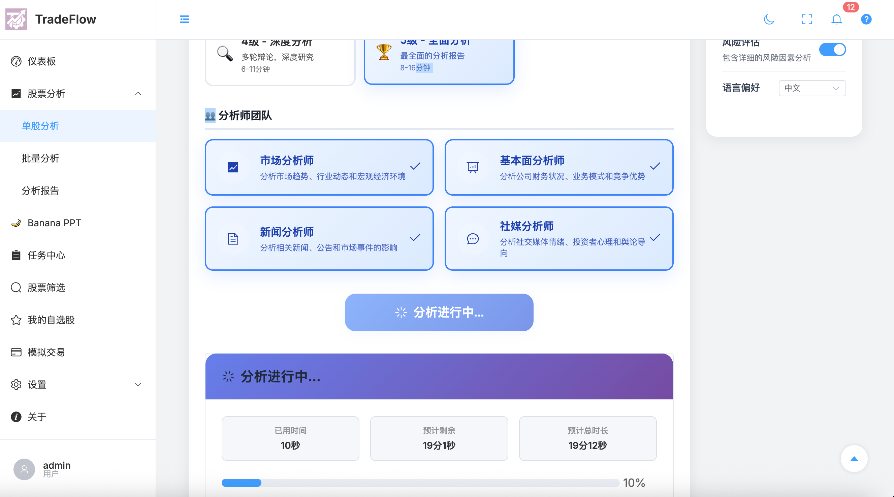
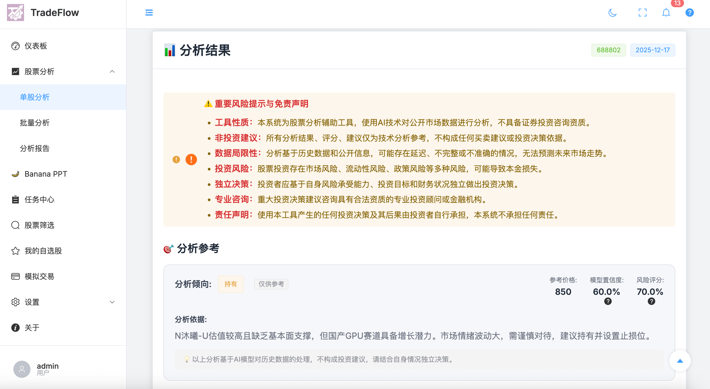
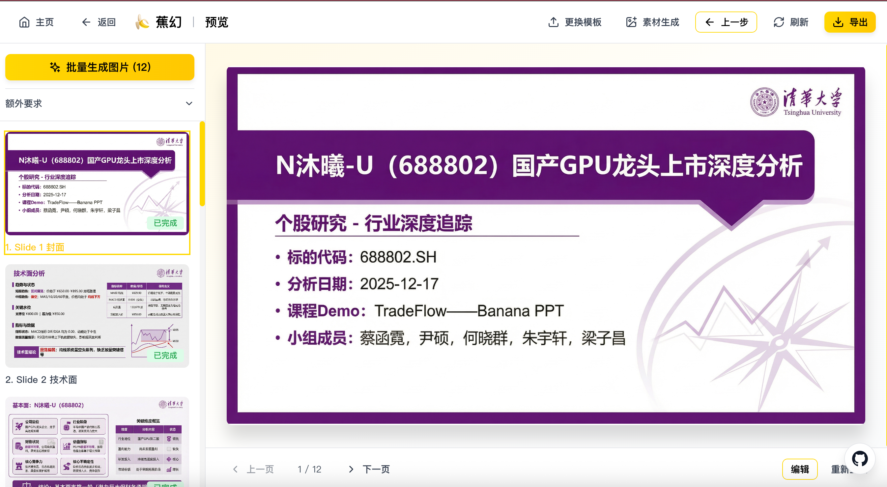
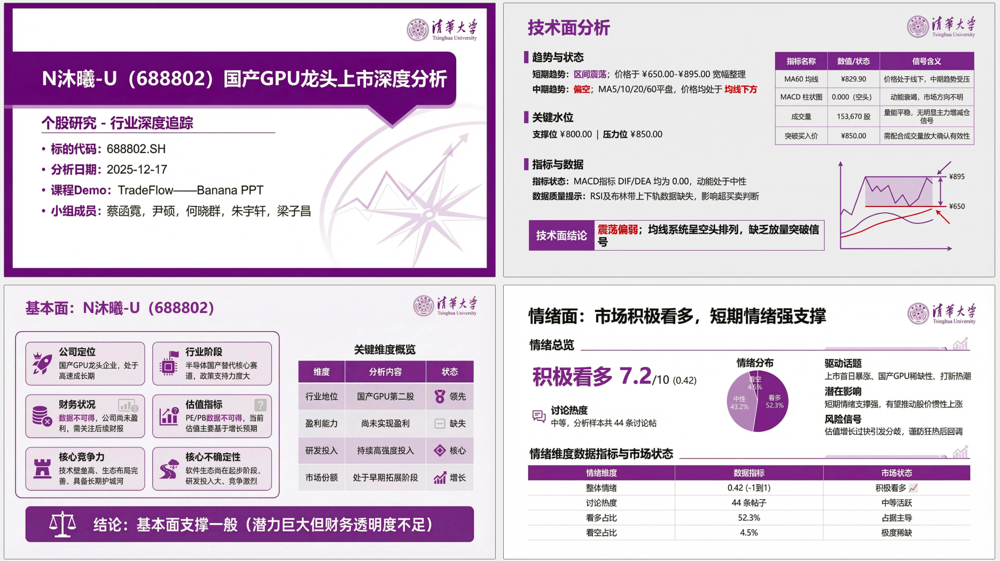
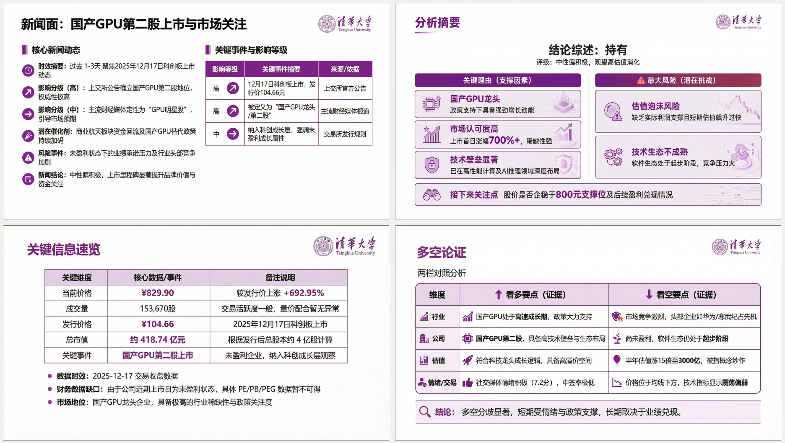
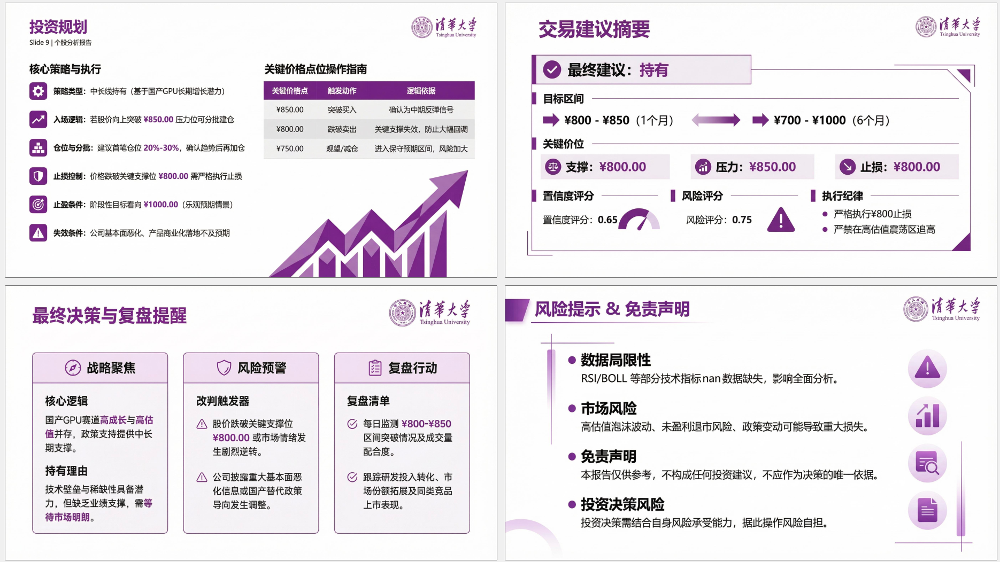

# TradeFlow - 多智能体股票分析系统

> **金融科技导论 - 课程Demo**

TradeFlow 是一个基于多智能体协作和大语言模型的智能股票分析系统，通过模拟真实交易公司的团队协作模式，实现全面的股票研究与分析。

## 📖 项目简介

TradeFlow 采用多智能体架构，将不同专业背景的分析师、研究员、交易员和风险管理人员数字化为AI智能体，通过协作机制完成股票分析任务。系统支持A股、港股、美股三大市场，提供从技术分析到基本面分析、从新闻情绪到社交媒体的全方位分析能力。

### 核心特性

- 🤖 **多智能体协作**：市场分析师、基本面分析师、新闻分析师、社媒分析师并行工作
- 📊 **多维度分析**：技术分析、基本面分析、新闻分析、情绪分析
- 🔄 **结构化辩论**：看涨/看跌研究员进行观点交锋，形成投资共识
- ⚠️ **风险管理**：多层次风险评估和动态风险控制
- 🌐 **多市场支持**：A股、港股、美股全覆盖
- 🎨 **现代化界面**：Vue 3 + Element Plus 打造的现代化Web界面

## 🏗️ 系统架构

### 整体架构

TradeFlow 采用前后端分离的微服务架构：

```
┌─────────────────┐
│   Web Frontend  │  Vue 3 + Element Plus
│   (Vue 3)       │
└────────┬────────┘
         │ REST API / WebSocket
┌────────▼────────┐
│  FastAPI Backend│  Python + FastAPI
│   (Python)      │
└────────┬────────┘
         │
    ┌────┴────┬──────────┬──────────┐
    │         │          │          │
┌───▼───┐ ┌──▼───┐ ┌───▼───┐ ┌───▼───┐
│MongoDB│ │Redis │ │ LLM   │ │Data   │
│       │ │Cache │ │Provider│ │Source │
└───────┘ └──────┘ └───────┘ └───────┘
```

### 多智能体工作流

系统通过 LangGraph 构建智能体工作流，实现以下分析流程：

1. **分析师团队**（并行执行）
   - 📈 市场分析师：技术指标、价格趋势、市场情绪
   - 📊 基本面分析师：财务数据、业务模式、竞争优势
   - 📰 新闻分析师：新闻事件、公告、宏观影响
   - 💬 社媒分析师：社交媒体情绪、投资者心理

2. **研究员辩论**
   - 🐂 看涨研究员：乐观角度、增长潜力
   - 🐻 看跌研究员：悲观角度、风险识别
   - 👔 研究经理：辩论主持、共识形成

3. **交易决策**
   - 💼 交易员：制定交易策略、仓位管理

4. **风险评估**
   - ⚠️ 风险评估团队：多层次风险分析
   - 🎯 风险经理：最终风险决策

## 🖼️ 系统展示

### 主界面



系统主界面提供清晰的分析流程和实时进度跟踪，支持多种分析级别选择。

### 分析结果



分析结果页面展示完整的股票分析报告，包括投资建议、风险评分、模型置信度等关键信息。

### 系统架构图


完整的系统架构展示了从输入触发到输出生成的完整数据流和组件交互，包括展示层、服务层、编排层、执行层和基础设施层。

### Banana PPT 功能

Banana PPT 功能可以将股票分析结果自动生成为专业的演示文稿，支持批量生成和自定义编辑。

#### PPT 生成界面



PPT 生成界面支持选择分析报告、自定义模板、批量生成图片等功能。

#### PPT 生成示例

以下展示了从股票分析报告自动生成的 PPT 示例，包含封面、技术面分析、基本面分析、情绪面分析、新闻面分析和投资规划等完整内容：

| 示例1：封面与技术面 | 示例2：基本面与情绪面 | 示例3：新闻面与投资规划 |
|:---:|:---:|:---:|
|  |  |  |

生成的 PPT 包含：
- 📊 **技术面分析**：趋势分析、关键水位、技术指标
- 💼 **基本面分析**：公司定位、财务状况、估值指标、核心竞争力
- 📰 **情绪面分析**：市场情绪、讨论热度、情绪分布
- 📈 **新闻面分析**：核心新闻动态、关键事件、影响评估
- 💡 **投资规划**：交易建议、风险提示、复盘提醒

所有内容均基于多智能体分析结果自动生成，适合用于课程演示和报告展示。

## 🚀 快速开始

### 环境要求

- Python >= 3.10
- Node.js >= 18.0.0
- MongoDB >= 4.4
- Redis >= 6.0

### 安装步骤

#### 1. 克隆项目

```bash
git clone <repository-url>
cd TradeFlow
```

#### 2. 后端设置

```bash
# 安装Python依赖
pip install -r requirements.txt

# 或使用 uv
uv pip install -r requirements.txt
```

#### 3. 前端设置

```bash
cd frontend
npm install
```

#### 4. 配置环境变量

创建 `.env` 文件并配置必要的环境变量：

```env
# 数据库配置
MONGODB_URL=mongodb://localhost:27017
REDIS_URL=redis://localhost:6379

# LLM配置（选择一种或多种）
OPENAI_API_KEY=your_openai_key
GOOGLE_API_KEY=your_google_key
DASHSCOPE_API_KEY=your_dashscope_key
```

#### 5. 启动服务

**方式一：使用启动脚本**

```bash
# 启动所有服务
./start_all.sh
```

**方式二：手动启动**

```bash
# 终端1：启动后端
python -m app

# 终端2：启动前端
cd frontend
npm run dev
```

**方式三：使用Docker Compose**

```bash
docker-compose up -d
```

### 访问系统

- 前端界面：http://localhost:3000
- 后端API：http://localhost:8000
- API文档：http://localhost:8000/docs

## 📁 项目结构

```
TradeFlow/
├── app/                    # FastAPI 后端应用
│   ├── core/              # 核心配置和数据库
│   ├── routers/           # API 路由
│   ├── services/          # 业务逻辑服务
│   ├── models/            # 数据模型
│   └── worker/            # 后台任务
├── frontend/              # Vue 3 前端应用
│   ├── src/
│   │   ├── components/    # 组件
│   │   ├── views/         # 页面
│   │   └── api/           # API 调用
├── tradingagents/         # 多智能体核心框架
│   ├── graph/             # LangGraph 工作流
│   ├── agents/            # 智能体定义
│   └── tools/             # 分析工具
├── config/                # 配置文件
├── docs/                  # 项目文档
├── examples/              # 示例代码
└── tests/                 # 测试文件
```

## 🎯 主要功能

### 1. 股票分析

- **单股分析**：对单只股票进行深度分析
- **批量分析**：同时分析多只股票
- **历史分析**：查看历史分析记录

### 2. 股票筛选

- 基于多维度指标的智能筛选
- 自定义筛选条件
- 筛选结果导出

### 3. 自选股管理

- 个人自选股收藏
- 分组管理
- 实时跟踪

### 4. 报告导出

- Markdown 格式
- Word 文档
- PDF 报告

### 5. Banana PPT

集成 Banana Slides 功能，支持将分析结果自动生成PPT演示文稿。

## 🛠️ 技术栈

### 后端
- **框架**：FastAPI + Uvicorn
- **数据库**：MongoDB + Redis
- **AI框架**：LangGraph + LangChain
- **数据源**：Tushare、AkShare、BaoStock、Yahoo Finance

### 前端
- **框架**：Vue 3 + Vite
- **UI组件**：Element Plus
- **状态管理**：Pinia
- **HTTP客户端**：Axios

### AI/LLM
- **支持模型**：OpenAI、Google Gemini、阿里通义千问、DeepSeek、Anthropic Claude
- **工作流引擎**：LangGraph
- **工具调用**：LangChain Tools

## 📚 使用指南

### 基本使用流程

1. **数据同步**：首次使用前，需要同步股票基础数据
   ```bash
   # 通过Web界面：设置 -> 数据同步
   # 或通过CLI
   python -m cli.main --sync
   ```

2. **配置LLM**：在设置页面配置LLM API密钥

3. **开始分析**：
   - 选择"单股分析"
   - 输入股票代码（如：688802）
   - 选择分析级别
   - 点击"开始分析"

4. **查看结果**：分析完成后，在"分析报告"中查看详细结果

### 分析级别说明

- **3级分析**：基础分析，快速获取投资建议（约8-16分钟）
- **4级分析**：深度分析，多轮辩论和深度研究（约6-11分钟）

## 🔧 开发指南

### 运行测试

```bash
# 运行所有测试
pytest tests/

# 运行特定测试
pytest tests/test_analysis.py
```

### 代码规范

项目遵循 PEP 8 Python 代码规范，使用 Black 进行代码格式化。

```bash
# 格式化代码
black app/ tradingagents/

# 检查代码
flake8 app/ tradingagents/
```

## 📝 配置说明

主要配置文件位于 `config/` 目录：

- `settings.json`：系统设置
- `models.json`：LLM模型配置
- `pricing.json`：模型定价信息

详细配置说明请参考 [配置文档](config/README.md)。

## ⚠️ 重要声明

**本系统仅用于研究和教育目的，不构成投资建议。**

- 📊 所有分析结果仅供参考
- 🤖 AI模型的预测存在不确定性
- 💰 投资有风险，决策需谨慎
- 👨‍💼 建议咨询专业财务顾问

## 📄 许可证

本项目采用混合许可证模式：
- 核心框架部分：Apache 2.0
- 应用层部分：需商业授权

详见 [LICENSE](LICENSE) 文件。

## 🙏 致谢

本项目基于 [TradingAgents](https://github.com/TauricResearch/TradingAgents) 项目开发，感谢 Tauric Research 团队的开源贡献。

---

<div align="center">

**金融科技导论 - 课程Demo**

**TradeFlow - 多智能体股票分析系统**

</div>
