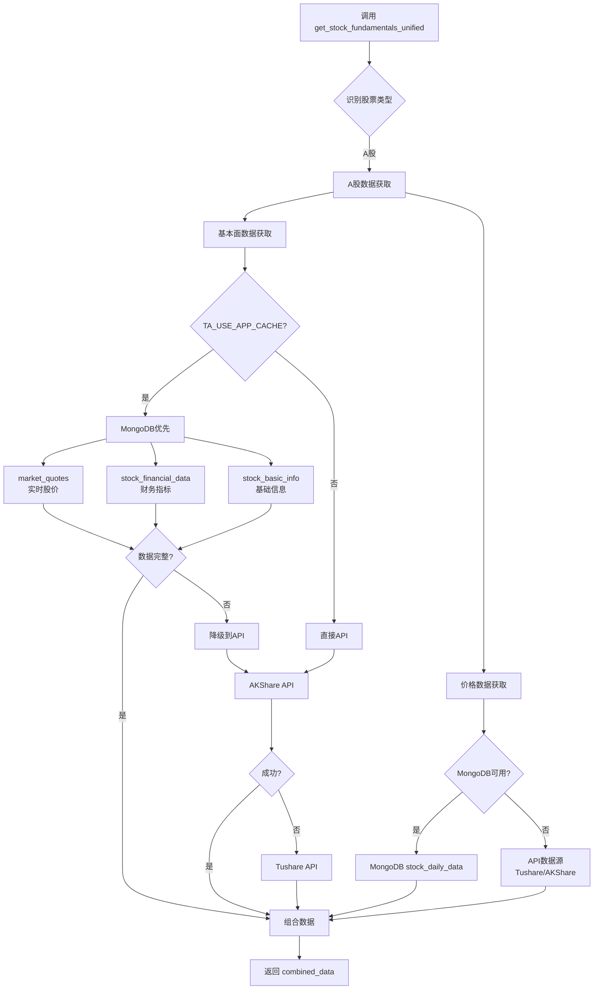
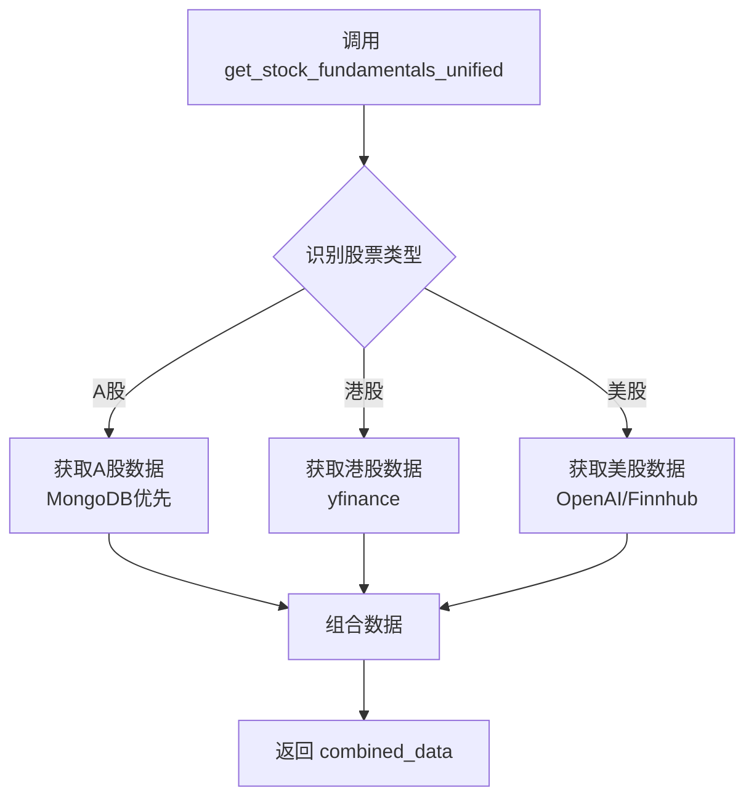

# combined_data 数据结构分析

## 📋 概述

`combined_data` 是 `get_stock_fundamentals_unified` 工具返回的综合数据，包含了股票的基本面分析所需的所有关键信息。这个工具会根据股票类型（A股/港股/美股）自动选择合适的数据源并返回格式化的数据。

## ⚠️ 重要：数据获取优先级

### MongoDB 优先策略

**对于A股数据，系统采用 MongoDB 优先策略**：

1. **第一优先级：MongoDB 数据库**
   - 如果启用了 `TA_USE_APP_CACHE` 环境变量
   - 优先从以下 MongoDB 集合获取数据：
     - `market_quotes` - 实时股价
     - `stock_financial_data` - 财务指标
     - `stock_basic_info` - 基础信息
     - `stock_daily_data` - 历史交易数据

2. **第二优先级：API 数据源**
   - MongoDB 数据不可用或不完整时
   - 按配置的优先级调用 API：
     - AKShare API（默认第一优先级）
     - Tushare API（默认第二优先级）
     - BaoStock API（默认第三优先级）

3. **数据源优先级配置**
   - 可通过 Web 界面的"数据源管理"配置优先级
   - 配置存储在 MongoDB `datasource_groupings` 集合
   - 支持按市场类别（A股/港股/美股）设置不同优先级

### 为什么 MongoDB 优先？

- ✅ **性能更快**：本地数据库查询比API调用快10-100倍
- ✅ **稳定可靠**：不受API限流、网络波动影响
- ✅ **数据一致**：定时同步任务保证数据新鲜度
- ✅ **成本更低**：减少API调用次数，降低费用
- ✅ **离线可用**：即使API不可用也能继续分析

## 🎯 调用位置

在 `fundamentals_analyst.py` 第 422-427 行：

```python
combined_data = unified_tool.invoke({
    'ticker': ticker,
    'start_date': start_date,
    'end_date': current_date,
    'curr_date': current_date
})
```

## 📊 数据结构详解

### 1. 总体结构

`combined_data` 是一个**字符串类型**的格式化数据，包含以下主要部分：

```
# {ticker} 基本面分析数据

**股票类型**: {市场名称}
**货币**: {货币名称} ({货币符号})
**分析日期**: {当前日期}
**数据深度级别**: {数据深度}

{具体数据模块}

---
*数据来源: 根据股票类型自动选择最适合的数据源*
```

### 2. 针对不同市场的数据内容

#### 2.1 中国A股数据 (is_china=True)

对于A股，`combined_data` 包含两个主要模块：

##### 模块1: A股当前价格信息

```markdown
## A股当前价格信息

股票代码: {ticker}
股票名称: {公司名称}
交易所: {上海证券交易所/深圳证券交易所}
行业: {所属行业}
板块: {主板/创业板/科创板/北交所}

=== 最新价格数据 ===
日期: {最新交易日}
开盘价: {开盘价} 元
最高价: {最高价} 元
最低价: {最低价} 元
收盘价: {收盘价} 元
成交量: {成交量} 股
成交额: {成交额} 元
涨跌幅: {涨跌幅}%
换手率: {换手率}%
```

**数据来源**: `get_china_stock_data_unified()` 函数
- **第一优先级**: MongoDB `stock_daily_data` 集合（历史交易数据缓存）
- **第二优先级**: 按配置的数据源优先级（默认：Tushare → AKShare → BaoStock）
- 包含最近1-2天的交易数据

##### 模块2: A股基本面财务数据

```markdown
## A股基本面财务数据

### 1. 公司基本信息
- 股票代码: {ticker}
- 公司名称: {公司全称}
- 所属行业: {行业分类}
- 上市板块: {主板/创业板/科创板/北交所}
- 上市日期: {上市日期}

### 2. 估值指标
- 市盈率 (PE): {PE值}
- 市净率 (PB): {PB值}
- 市销率 (PS): {PS值}
- 总市值: {总市值} 亿元
- 流通市值: {流通市值} 亿元

### 3. 财务指标
- 净资产收益率 (ROE): {ROE}%
- 总资产收益率 (ROA): {ROA}%
- 资产负债率: {负债率}%
- 流动比率: {流动比率}
- 速动比率: {速动比率}
- 毛利率: {毛利率}%
- 净利率: {净利率}%

### 4. 盈利能力分析
- 营业收入: {营业收入} 亿元
- 净利润: {净利润} 亿元
- 同比增长率: {增长率}%
- 每股收益 (EPS): {EPS} 元

### 5. 成长性分析
- 营收增长率: {营收增长率}%
- 利润增长率: {利润增长率}%
- 行业地位: {行业排名/市场份额}

### 6. 风险评估
- 财务风险: {低/中/高}
- 经营风险: {低/中/高}
- 市场风险: {低/中/高}

### 7. 投资建议
- 估值水平: {低估/合理/高估}
- 合理价位区间: {最低价} - {最高价} 元
- 目标价位: {目标价} 元
- 投资建议: {买入/持有/卖出}
```

**数据来源**: `OptimizedChinaDataProvider._generate_fundamentals_report()` 方法

数据获取优先级：
1. **MongoDB 优先**（如果启用 `TA_USE_APP_CACHE`）：
   - `market_quotes` 集合 → 实时股价
   - `stock_financial_data` 集合 → 财务指标（ROE、负债率、利润等）
   - `stock_basic_info` 集合 → 基础信息（行业、板块、市值、PE、PB等）

2. **API 数据源**（MongoDB 无数据时降级）：
   - AKShare API → 财务数据
   - Tushare API → 财务数据（AKShare失败时）

3. **智能处理**：
   - 解析和标准化不同来源的数据格式
   - 基于行业特征进行估值分析
   - 计算综合评分（基本面评分、估值评分、成长性评分）

#### 2.2 港股数据 (is_hk=True)

根据数据深度级别，港股数据包含不同的内容：

##### 基础级别 (data_depth="basic" 或 "standard")

```markdown
## 港股基础信息

**股票代码**: {ticker}
**股票名称**: {公司名称}
**交易货币**: 港币 (HK$)
**交易所**: 香港交易所 (HKG)
**数据源**: {数据源名称}

**基本面分析建议**：
- 建议查看公司最新财报
- 关注港股市场整体走势
- 考虑汇率因素对投资的影响
```

##### 完整级别 (data_depth="full" 或 "detailed" 或 "comprehensive")

```markdown
## 港股数据

### 股票基本信息
- 股票代码: {ticker}
- 公司名称: {公司名称}
- 交易货币: 港币 (HK$)
- 交易所: 香港交易所 (HKG)
- 行业: {所属行业}
- 板块: {所属板块}

### 价格数据
- 最新价格: {最新价} 港币
- 开盘价: {开盘价} 港币
- 最高价: {最高价} 港币
- 最低价: {最低价} 港币
- 成交量: {成交量}
- 成交额: {成交额} 港币

### 估值指标
- 市值: {市值} 港币
- 市盈率: {PE}
- 市净率: {PB}
```

**数据来源**: 
- `get_hk_stock_data_unified()` - 使用 yfinance 获取港股数据
- `get_hk_stock_info_unified()` - 获取港股基础信息

#### 2.3 美股数据 (is_us=True)

根据数据深度级别，美股数据包含不同的内容：

##### 基础级别 (data_depth="basic" 或 "standard")

```markdown
## 美股基础信息

**股票代码**: {ticker}
**股票类型**: 美股
**交易货币**: 美元 (USD)
**交易所**: 美国证券交易所

**基本面分析建议**：
- 建议查看公司最新财报
- 关注美股市场整体走势
- 考虑美元汇率因素对投资的影响
- 关注美联储政策对股市的影响
```

##### 完整级别 (data_depth="full" 或 "detailed" 或 "comprehensive")

```markdown
## 美股基本面数据

### 公司信息
- 股票代码: {ticker}
- 公司名称: {公司名称}
- 交易货币: 美元 (USD)
- 行业: {所属行业}
- 板块: {所属板块}

### 财务数据
- 市值: {市值} 美元
- 市盈率 (PE): {PE}
- 市净率 (PB): {PB}
- 营业收入: {营业收入} 美元
- 净利润: {净利润} 美元
- 每股收益 (EPS): {EPS} 美元

### 分析师观点
- 目标价: {目标价} 美元
- 评级: {买入/持有/卖出}
```

**数据来源**: `get_fundamentals_openai()` - 使用 OpenAI 或 Finnhub API

## 🔍 数据来源总结

### A股（中国股票）- MongoDB 优先
**第一优先级：MongoDB 数据库**
- `market_quotes` - 实时行情
- `stock_financial_data` - 财务数据
- `stock_basic_info` - 基础信息
- `stock_daily_data` - 历史数据

**第二优先级：API 数据源**（降级策略）
- AKShare API（默认第一API优先级）
- Tushare API（默认第二API优先级）
- BaoStock API（默认第三API优先级）

### 港股
- yfinance API（主要）
- AKShare API（备用）

### 美股
- OpenAI API（主要）
- Finnhub API（备用）

## 🔍 数据深度级别说明

`combined_data` 的详细程度由 `data_depth` 参数控制：

| 级别 | 说明 | 包含内容 |
|------|------|----------|
| `basic` | 快速分析 | 基础信息 + 当前价格 |
| `standard` | 标准分析 | 基础信息 + 当前价格 + 基础估值指标 |
| `full` | 深度分析 | 完整的价格数据 + 财务指标 + 估值分析 |
| `detailed` | 详细分析 | 完整数据 + 详细财务分析 |
| `comprehensive` | 全面分析 | 所有可用数据 + 深度分析 + 投资建议 |

## 📈 数据字段详解

### 价格相关字段
- **开盘价 (open)**: 当日开盘时的价格
- **最高价 (high)**: 当日最高价格
- **最低价 (low)**: 当日最低价格
- **收盘价 (close)**: 当日收盘价格
- **成交量 (volume)**: 当日成交股票数量
- **成交额 (amount)**: 当日成交金额总额
- **涨跌幅 (change_percent)**: 相对前一交易日的涨跌百分比
- **换手率 (turnover_rate)**: 成交量占流通股本的比例

### 估值指标字段
- **市盈率 (PE)**: 股价 / 每股收益，衡量股票估值水平
- **市净率 (PB)**: 股价 / 每股净资产，衡量资产价值
- **市销率 (PS)**: 市值 / 营业收入，衡量销售能力
- **总市值 (total_mv)**: 股价 × 总股本
- **流通市值 (circ_mv)**: 股价 × 流通股本

### 财务指标字段
- **净资产收益率 (ROE)**: 净利润 / 净资产，衡量盈利能力
- **总资产收益率 (ROA)**: 净利润 / 总资产，衡量资产使用效率
- **资产负债率 (debt_ratio)**: 负债 / 资产，衡量财务风险
- **流动比率 (current_ratio)**: 流动资产 / 流动负债，衡量短期偿债能力
- **速动比率 (quick_ratio)**: (流动资产 - 存货) / 流动负债
- **毛利率 (gross_margin)**: (营业收入 - 营业成本) / 营业收入
- **净利率 (net_margin)**: 净利润 / 营业收入

## 🔧 数据获取流程

### A股数据获取流程（重点）



### 完整流程（所有市场）



## 💡 使用示例

### 示例1: A股基本面分析

```python
# 输入参数
ticker = "000001"  # 平安银行
start_date = "2025-05-28"
end_date = "2025-11-04"
curr_date = "2025-11-04"

# 返回的 combined_data 包含:
"""
# 000001 基本面分析数据

**股票类型**: 中国A股
**货币**: 人民币 (¥)
**分析日期**: 2025-11-04
**数据深度级别**: standard

## A股当前价格信息
股票代码: 000001
股票名称: 平安银行
交易所: 深圳证券交易所
行业: 银行
板块: 主板

=== 最新价格数据 ===
日期: 2025-11-04
收盘价: 13.45 元
涨跌幅: +1.2%
成交量: 45678900 股
换手率: 0.85%

## A股基本面财务数据
### 估值指标
- 市盈率 (PE): 4.94
- 市净率 (PB): 0.50
- 总市值: 2200.63 亿元

### 财务指标
- 净资产收益率 (ROE): 4.95%
- 资产负债率: 91.32%

### 投资建议
- 估值水平: 低估
- 投资建议: 买入
"""
```

## 📝 注意事项

1. **数据格式**: `combined_data` 是字符串类型，使用 Markdown 格式化
2. **数据完整性**: 根据数据源可用性，某些字段可能为空或显示"待分析"
3. **数据时效性**: 价格数据为最近交易日数据，财务数据为最新财报数据
4. **货币单位**: 
   - A股使用人民币 (¥)
   - 港股使用港币 (HK$)
   - 美股使用美元 (USD)
5. **错误处理**: 如果数据获取失败，会包含错误信息和建议

## 📦 MongoDB 集合说明

### 1. `market_quotes` - 实时行情数据
存储股票的实时价格信息：
- `code`: 6位股票代码
- `close`: 收盘价
- `open`: 开盘价
- `high`: 最高价
- `low`: 最低价
- `volume`: 成交量
- `amount`: 成交额
- `change_percent`: 涨跌幅
- `turnover_rate`: 换手率

### 2. `stock_financial_data` - 财务数据
存储股票的财务指标：
- `code`/`symbol`: 股票代码
- `report_period`: 报告期（如：20250630）
- `data_source`: 数据来源（tushare/akshare）
- `financial_indicators`: 财务指标对象
  - `roe`: 净资产收益率
  - `roa`: 总资产收益率
  - `debt_to_assets`: 资产负债率
  - `current_ratio`: 流动比率
  - `quick_ratio`: 速动比率
  - `gross_margin`: 毛利率
  - `net_margin`: 净利率

### 3. `stock_basic_info` - 基础信息
存储股票的基本信息：
- `code`: 6位股票代码
- `name`: 股票名称
- `industry`: 所属行业
- `market`: 板块（主板/创业板/科创板/北交所）
- `pe`: 市盈率
- `pb`: 市净率
- `total_mv`: 总市值（亿元）
- `circ_mv`: 流通市值（亿元）
- `source`: 数据来源（tushare/akshare/baostock）

### 4. `stock_daily_data` - 历史交易数据
存储股票的历史日线数据（用于技术分析）

## 🔗 相关文件

### 核心文件
- **工具定义**: `tradingagents/agents/utils/agent_utils.py` (第 770-1164 行)
  - `get_stock_fundamentals_unified()` 统一基本面分析工具

- **A股数据处理**: `tradingagents/dataflows/optimized_china_data.py`
  - `OptimizedChinaDataProvider` 类
  - `_get_real_financial_metrics()` - MongoDB优先的财务数据获取
  - `_generate_fundamentals_report()` - 基本面报告生成

### MongoDB 相关
- **MongoDB缓存适配器**: `tradingagents/dataflows/cache/mongodb_cache_adapter.py`
  - `get_stock_basic_info()` - 按数据源优先级获取基础信息
  - `get_financial_data()` - 按数据源优先级获取财务数据
  - `_get_data_source_priority()` - 获取数据源优先级配置

- **数据库管理**: `tradingagents/config/database_manager.py`
  - MongoDB 连接管理
  - 数据库可用性检查

### 其他市场
- **港股数据**: `tradingagents/dataflows/providers/hk/improved_hk.py`
- **美股数据**: `tradingagents/dataflows/interface.py`
- **数据源管理**: `tradingagents/dataflows/data_source_manager.py`

### 配置相关
- **运行时配置**: `tradingagents/config/runtime_settings.py`
  - `use_app_cache_enabled()` - 检查是否启用MongoDB缓存

- **统一配置**: `app/core/unified_config.py`
  - 数据源优先级配置管理

