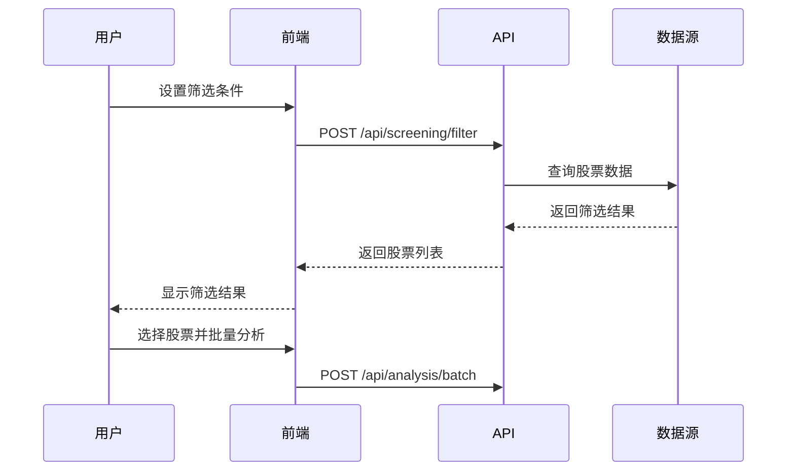
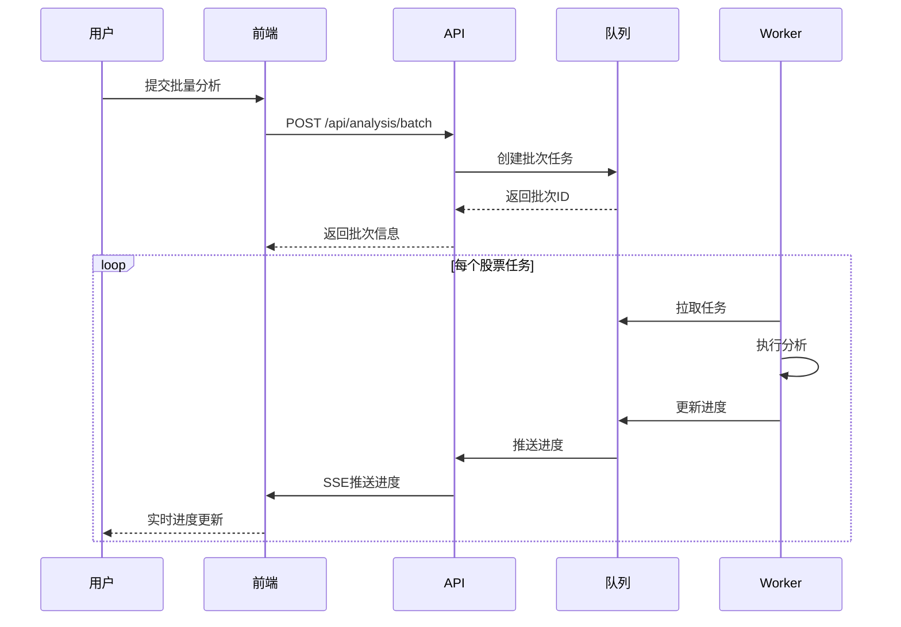
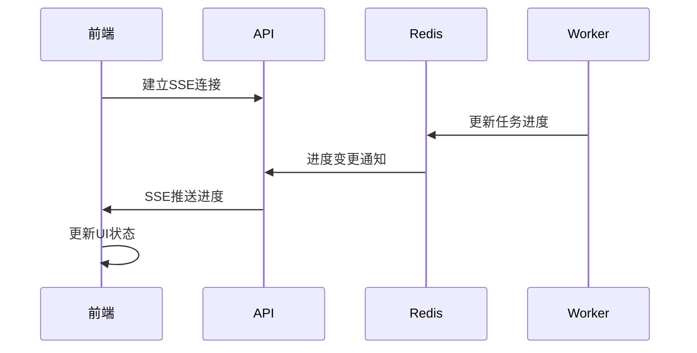

# TradingAgents-CN v0.1.16 系统架构设计

## 架构概览

TradingAgents-CN v0.1.16 采用现代化的前后端分离架构，引入任务队列系统和选股功能，实现高并发、可扩展的股票分析平台。

```
┌─────────────────┐    ┌─────────────────┐    ┌─────────────────┐
│   Vue3 前端     │    │   FastAPI 后端  │    │   Redis 队列    │
│                 │    │                 │    │                 │
│ ┌─────────────┐ │    │ ┌─────────────┐ │    │ ┌─────────────┐ │
│ │ 选股界面    │ │────│ │ 选股API     │ │    │ │ 任务队列    │ │
│ └─────────────┘ │    │ └─────────────┘ │    │ └─────────────┘ │
│ ┌─────────────┐ │    │ ┌─────────────┐ │    │ ┌─────────────┐ │
│ │ 批量分析    │ │────│ │ 分析API     │ │────│ │ 进度缓存    │ │
│ └─────────────┘ │    │ └─────────────┘ │    │ └─────────────┘ │
│ ┌─────────────┐ │    │ ┌─────────────┐ │    │                 │
│ │ 队列状态    │ │────│ │ SSE推送     │ │    │                 │
│ └─────────────┘ │    │ └─────────────┘ │    │                 │
└─────────────────┘    └─────────────────┘    └─────────────────┘
         │                       │                       │
         │              ┌─────────────────┐              │
         │              │   MongoDB 存储  │              │
         │              │                 │              │
         │              │ ┌─────────────┐ │              │
         │              │ │ 用户数据    │ │              │
         │              │ └─────────────┘ │              │
         │              │ ┌─────────────┐ │              │
         │              │ │ 分析历史    │ │              │
         │              │ └─────────────┘ │              │
         │              │ ┌─────────────┐ │              │
         │              │ │ 系统配置    │ │              │
         │              │ └─────────────┘ │              │
         │              └─────────────────┘              │
         │                                               │
         └───────────────┐               ┌───────────────┘
                         │               │
                ┌─────────────────┐     ┌─────────────────┐
                │  Worker 进程 1  │     │  Worker 进程 2  │
                │                 │     │                 │
                │ ┌─────────────┐ │     │ ┌─────────────┐ │
                │ │ 任务消费    │ │     │ │ 任务消费    │ │
                │ └─────────────┘ │     │ └─────────────┘ │
                │ ┌─────────────┐ │     │ ┌─────────────┐ │
                │ │ 分析执行    │ │     │ │ 分析执行    │ │
                │ └─────────────┘ │     │ └─────────────┘ │
                │ ┌─────────────┐ │     │ ┌─────────────┐ │
                │ │ 进度上报    │ │     │ │ 进度上报    │ │
                │ └─────────────┘ │     │ └─────────────┘ │
                └─────────────────┘     └─────────────────┘
```

## 核心组件

### 1. 前端层 (Vue3 SPA)

#### 技术栈
```typescript
Vue3 + Composition API
├── Vite (构建工具)
├── Pinia (状态管理)
├── Vue Router 4 (路由)
├── Axios (HTTP客户端)
├── Element Plus (UI组件)
└── EventSource (SSE支持)
```

#### 核心模块
```
src/
├── components/          # 通用组件
│   ├── StockSelector/   # 选股组件
│   ├── BatchAnalysis/   # 批量分析
│   ├── QueueStatus/     # 队列状态
│   └── ProgressBar/     # 进度条
├── views/              # 页面视图
│   ├── Dashboard/      # 主面板
│   ├── Analysis/       # 分析页面
│   ├── History/        # 历史记录
│   └── Settings/       # 设置页面
├── stores/             # Pinia状态
│   ├── auth.js         # 认证状态
│   ├── analysis.js     # 分析状态
│   └── queue.js        # 队列状态
└── services/           # API服务
    ├── api.js          # API封装
    ├── sse.js          # SSE连接
    └── websocket.js    # WebSocket(备选)
```

### 2. 后端层 (FastAPI)

#### 技术栈
```python
FastAPI + Uvicorn
├── Pydantic (数据验证)
├── SQLAlchemy/Motor (数据库ORM)
├── Redis-py (Redis客户端)
├── JWT/Session (认证)
└── asyncio (异步支持)
```

#### 核心模块
```
webapi/
├── main.py             # FastAPI应用入口
├── routers/            # 路由模块
│   ├── auth.py         # 认证接口
│   ├── analysis.py     # 分析接口
│   ├── screening.py    # 选股接口
│   ├── queue.py        # 队列管理
│   └── sse.py          # 服务端推送
├── services/           # 业务逻辑
│   ├── auth_service.py # 认证服务
│   ├── queue_service.py# 队列服务
│   ├── analysis_service.py # 分析服务
│   └── screening_service.py # 选股服务
├── models/             # 数据模型
│   ├── user.py         # 用户模型
│   ├── analysis.py     # 分析模型
│   └── queue.py        # 队列模型
├── schemas/            # API数据结构
│   ├── auth.py         # 认证Schema
│   ├── analysis.py     # 分析Schema
│   └── queue.py        # 队列Schema
└── core/               # 核心组件
    ├── config.py       # 配置管理
    ├── security.py     # 安全组件
    └── database.py     # 数据库连接
```

### 3. 队列系统 (Redis)

#### 队列设计
```
分析队列结构:
├── user:{user_id}:pending     # 用户待处理队列
├── user:{user_id}:processing  # 用户处理中队列
├── global:pending             # 全局待处理队列
├── global:processing          # 全局处理中队列
└── results:{task_id}          # 任务结果缓存
```

#### 队列管理策略
- **并发控制**: 每用户最多3个并发任务
- **优先级**: 用户级 > 批次级 > 任务级
- **超时处理**: 可见性超时 + 心跳机制
- **失败重试**: 指数退避 + 最大重试次数

### 4. 工作进程 (Worker)

#### 进程架构
```
Worker进程设计:
├── 队列消费器         # 从Redis拉取任务
├── 任务执行器         # 调用run_stock_analysis
├── 进度上报器         # 实时进度更新
├── 结果处理器         # 结果存储和通知
└── 异常处理器         # 错误恢复和重试
```

#### 生命周期管理
```python
# Worker生命周期
async def worker_lifecycle():
    while True:
        try:
            # 1. 拉取任务
            task = await queue_service.dequeue()
            if not task:
                await asyncio.sleep(1)
                continue
            
            # 2. 执行任务
            await execute_analysis_task(task)
            
            # 3. 确认完成
            await queue_service.ack(task.id)
            
        except Exception as e:
            # 4. 错误处理
            await handle_error(task, e)
```

## 数据流设计

### 1. 选股流程


### 2. 批量分析流程


### 3. 实时进度推送


## 数据存储设计

### 1. MongoDB集合设计

#### 用户集合 (users)
```javascript
{
  _id: ObjectId,
  username: String,
  email: String,
  hashed_password: String,
  is_active: Boolean,
  created_at: Date,
  updated_at: Date,
  preferences: {
    default_market: String,
    default_depth: String,
    ui_theme: String
  }
}
```

#### 分析批次集合 (analysis_batches)
```javascript
{
  _id: ObjectId,
  batch_id: String,           // 批次唯一标识
  user_id: ObjectId,          // 用户ID
  title: String,              // 批次标题
  status: String,             // pending/processing/completed/failed
  total_tasks: Number,        // 总任务数
  completed_tasks: Number,    // 已完成任务数
  failed_tasks: Number,       // 失败任务数
  progress: Number,           // 整体进度 0-100
  created_at: Date,
  started_at: Date,
  completed_at: Date,
  parameters: {               // 分析参数
    market_type: String,
    analysis_date: Date,
    research_depth: String,
    selected_analysts: Array
  },
  results_summary: {          // 结果摘要
    successful_analyses: Array,
    failed_analyses: Array,
    total_tokens_used: Number
  }
}
```

#### 分析任务集合 (analysis_tasks)
```javascript
{
  _id: ObjectId,
  task_id: String,            // 任务唯一标识
  batch_id: String,           // 所属批次
  user_id: ObjectId,          // 用户ID
  stock_code: String,         // 股票代码
  status: String,             // queued/processing/completed/failed/cancelled
  priority: Number,           // 优先级
  progress: Number,           // 任务进度 0-100
  created_at: Date,
  started_at: Date,
  completed_at: Date,
  worker_id: String,          // 处理的Worker ID
  parameters: Object,         // 分析参数
  result: {                   // 分析结果
    analysis_id: String,      // 分析记录ID
    tokens_used: Number,
    execution_time: Number,
    error_message: String
  },
  retry_count: Number,        // 重试次数
  max_retries: Number         // 最大重试次数
}
```

### 2. Redis数据结构

#### 队列结构
```redis
# 用户待处理队列
LIST user:{user_id}:pending
# 值: JSON序列化的任务对象

# 用户处理中集合
SET user:{user_id}:processing
# 值: task_id列表

# 全局队列状态
HASH queue:stats
# 字段: total_pending, total_processing, total_completed

# 任务进度缓存
HASH task:{task_id}:progress
# 字段: progress, status, message, updated_at

# 批次聚合进度
HASH batch:{batch_id}:progress
# 字段: total, completed, failed, progress_percentage
```

#### 会话和缓存
```redis
# 用户会话
HASH session:{session_id}
# 字段: user_id, created_at, expires_at, last_activity

# API限流
STRING rate_limit:{user_id}:{endpoint}
# 值: 请求计数，带TTL

# 选股结果缓存
HASH screening:{cache_key}
# 字段: results, created_at, expires_at
```

## 安全设计

### 1. 认证授权
- **JWT Token**: 无状态认证，支持分布式部署
- **Token刷新**: 访问令牌短期 + 刷新令牌长期
- **权限控制**: 基于角色的访问控制(RBAC)

### 2. API安全
- **速率限制**: 防止API滥用
- **CORS配置**: 跨域请求安全
- **输入验证**: Pydantic严格验证
- **SQL注入防护**: ORM查询参数化

### 3. 数据安全
- **密码哈希**: bcrypt加密存储
- **敏感数据**: 环境变量管理
- **审计日志**: 关键操作记录

## 性能优化

### 1. 缓存策略
- **API响应缓存**: Redis缓存高频查询
- **静态资源**: CDN + 浏览器缓存
- **数据库查询**: 索引优化 + 连接池

### 2. 并发处理
- **异步IO**: FastAPI异步支持
- **连接池**: 数据库连接复用
- **队列优化**: 批处理 + 预取

### 3. 监控告警
- **性能指标**: 响应时间、吞吐量、错误率
- **资源监控**: CPU、内存、磁盘、网络
- **业务指标**: 任务成功率、队列长度

---

**文档版本**: v1.0  
**创建日期**: 2025-08-17  
**最后更新**: 2025-08-17  
**维护人员**: TradingAgents-CN开发团队