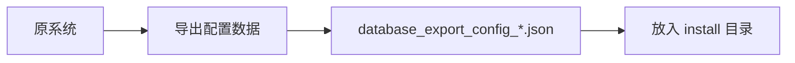
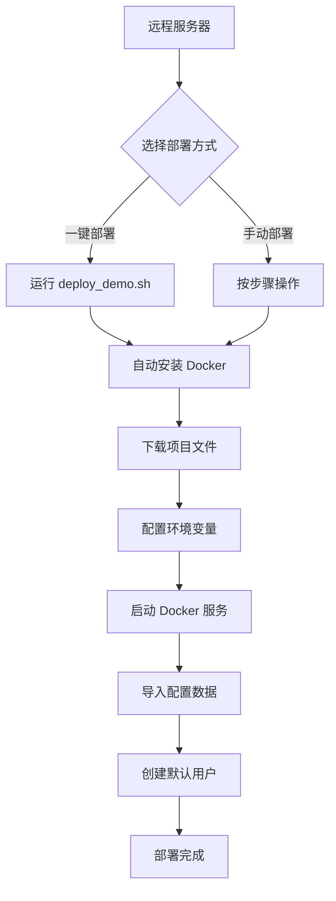
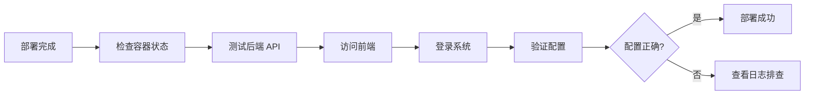
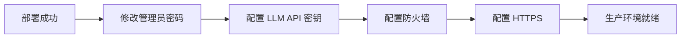

# 演示系统部署方案总结

## 📋 概述

本文档总结了为在远程服务器上部署 TradingAgents 演示系统而创建的完整解决方案。

---

## 🎯 部署目标

在远程服务器上快速部署一个包含完整配置的演示系统：

✅ **包含的内容**：
- 15 个 LLM 模型配置（Google Gemini、DeepSeek、百度千帆、阿里百炼、OpenRouter）
- 系统配置和平台设置
- 用户标签和市场分类
- 默认管理员账号（admin/admin123）

❌ **不包含的内容**：
- 历史分析报告
- 股票数据和行情数据
- 操作日志和调度历史
- 缓存数据

---

## 📦 创建的文件

### 1. 配置数据文件

| 文件 | 路径 | 说明 |
|------|------|------|
| 配置数据导出 | `install/database_export_config_2025-10-16.json` | 包含 9 个集合、48 个文档的配置数据 |
| 安装说明 | `install/README.md` | install 目录的使用说明 |

### 2. 部署脚本

| 文件 | 路径 | 说明 |
|------|------|------|
| 一键部署脚本 | `scripts/deploy_demo.sh` | 自动化部署脚本（Bash） |
| 导入配置脚本 | `scripts/import_config_and_create_user.py` | 导入配置数据并创建默认用户（Python） |
| 创建用户脚本 | `scripts/create_default_admin.py` | 只创建默认管理员用户（Python） |

### 3. 文档

| 文件 | 路径 | 说明 |
|------|------|------|
| 部署完整指南 | `docs/deploy_demo_system.md` | 详细的手动部署步骤 |
| 脚本导入指南 | `docs/import_config_with_script.md` | 使用 Python 脚本导入配置的说明 |
| 导出配置指南 | `docs/export_config_for_demo.md` | 如何导出配置数据的说明 |
| 部署方案总结 | `docs/demo_deployment_summary.md` | 本文档 |

---

## 🚀 部署方式

### 方式 1：一键部署（推荐）

**适用场景**：全新服务器，需要完整自动化部署

**命令**：
```bash
curl -fsSL https://raw.githubusercontent.com/your-org/TradingAgents-CN/main/scripts/deploy_demo.sh | bash
```

**自动完成的操作**：
1. ✅ 检查系统要求（内存、磁盘、操作系统）
2. ✅ 安装 Docker 和 Docker Compose
3. ✅ 下载项目文件（docker-compose、配置数据、脚本）
4. ✅ 配置环境变量（自动生成随机密钥）
5. ✅ 拉取 Docker 镜像
6. ✅ 启动服务（MongoDB、Redis、Backend、Frontend）
7. ✅ 导入配置数据（9 个集合、48 个文档）
8. ✅ 创建默认管理员（admin/admin123）
9. ✅ 验证部署
10. ✅ 显示访问信息

**预计时间**：5-10 分钟（取决于网络速度）

---

### 方式 2：手动部署

**适用场景**：需要更多控制，或一键脚本失败时

**步骤**：

#### 1. 安装 Docker

```bash
# Ubuntu/Debian
sudo apt-get update
sudo apt-get install -y docker-ce docker-ce-cli containerd.io docker-compose-plugin

# CentOS/RHEL
sudo yum install -y docker-ce docker-ce-cli containerd.io docker-compose-plugin
```

#### 2. 获取项目文件

```bash
# 克隆仓库
git clone https://github.com/your-org/TradingAgents-CN.git
cd TradingAgents-CN

# 或下载必要文件
mkdir -p TradingAgents-Demo/{install,scripts}
cd TradingAgents-Demo
# 下载 docker-compose.hub.yml、.env.example、配置文件、脚本等
```

#### 3. 配置环境变量

```bash
cp .env.example .env
nano .env  # 修改 SERVER_HOST、JWT_SECRET_KEY、密码等
```

#### 4. 启动服务

```bash
docker compose -f docker-compose.hub.yml pull
docker compose -f docker-compose.hub.yml up -d
sleep 15  # 等待服务启动
```

#### 5. 导入配置数据

```bash
pip3 install pymongo
python3 scripts/import_config_and_create_user.py
docker restart tradingagents-backend
```

#### 6. 访问系统

- 前端：`http://your-server:3000`
- 用户名：`admin`
- 密码：`admin123`

**预计时间**：15-20 分钟

---

### 方式 3：只导入配置（已有系统）

**适用场景**：系统已部署，只需要导入配置数据

**命令**：

```bash
# 只导入配置数据
python3 scripts/import_config_and_create_user.py install/database_export_config_2025-10-16.json

# 只创建默认用户
python3 scripts/create_default_admin.py

# 覆盖已存在的数据
python3 scripts/import_config_and_create_user.py --overwrite

# 只导入指定集合
python3 scripts/import_config_and_create_user.py --collections system_configs llm_providers
```

---

## 📖 完整工作流程

### 阶段 1：准备阶段



**操作**：
1. 在原系统登录前端
2. 进入：`系统管理` → `数据库管理`
3. 选择：`配置数据（用于演示系统）`
4. 导出格式：`JSON`
5. 下载并保存到 `install/` 目录

---

### 阶段 2：部署阶段



**关键步骤**：
1. ✅ 安装 Docker 和 Docker Compose
2. ✅ 获取项目文件（docker-compose.hub.yml、配置数据、脚本）
3. ✅ 配置 .env 文件（修改密码、密钥、服务器地址）
4. ✅ 拉取并启动 Docker 镜像
5. ✅ 等待服务启动（约 15 秒）
6. ✅ 运行导入脚本
7. ✅ 重启后端服务

---

### 阶段 3：验证阶段



**验证清单**：
- [ ] 4 个容器都在运行（mongodb、redis、backend、frontend）
- [ ] 后端 API 健康检查通过（`/api/health`）
- [ ] 前端可以访问（`http://server:3000`）
- [ ] 可以使用 admin/admin123 登录
- [ ] 系统配置页面显示 15 个 LLM 模型
- [ ] 数据库管理页面显示连接正常

---

### 阶段 4：安全加固



**安全措施**：
1. ⚠️ 立即修改默认管理员密码
2. ⚠️ 修改 MongoDB 和 Redis 密码
3. ⚠️ 配置防火墙（只开放必要端口）
4. ⚠️ 配置 HTTPS（使用 Nginx + Let's Encrypt）
5. ⚠️ 定期备份数据
6. ⚠️ 监控系统日志

---

## 🔧 技术细节

### 1. Docker 镜像

| 服务 | 镜像 | 说明 |
|------|------|------|
| Frontend | `hsliup/tradingagents-frontend:latest` | Vue 3 前端 |
| Backend | `hsliup/tradingagents-backend:latest` | FastAPI 后端 |
| MongoDB | `mongo:4.4` | 数据库 |
| Redis | `redis:7-alpine` | 缓存 |

### 2. 数据卷

| 数据卷 | 挂载点 | 说明 |
|--------|--------|------|
| `tradingagents_mongodb_data` | `/data/db` | MongoDB 数据 |
| `tradingagents_redis_data` | `/data` | Redis 数据 |

### 3. 端口映射

| 服务 | 容器端口 | 主机端口 | 说明 |
|------|---------|---------|------|
| Frontend | 80 | 3000 | 前端界面 |
| Backend | 8000 | 8000 | 后端 API |
| MongoDB | 27017 | 27017 | 数据库（可选） |
| Redis | 6379 | 6379 | 缓存（可选） |

### 4. 配置数据结构

```json
{
  "export_info": {
    "created_at": "2025-10-16T10:30:00",
    "collections": ["system_configs", "users", ...],
    "format": "json"
  },
  "data": {
    "system_configs": [...],
    "users": [...],
    "llm_providers": [...],
    ...
  }
}
```

### 5. 默认用户

```python
{
  "username": "admin",
  "password": "admin123",  # SHA256 哈希后存储
  "email": "admin@tradingagents.cn",
  "is_admin": True,
  "is_active": True,
  "is_verified": True,
  "daily_quota": 10000,
  "concurrent_limit": 10
}
```

---

## 📊 部署统计

### 资源使用

| 项目 | 大小/数量 |
|------|----------|
| Docker 镜像总大小 | ~2 GB |
| 配置数据文件 | ~500 KB |
| 集合数量 | 9 个 |
| 文档数量 | 48 个 |
| LLM 模型配置 | 15 个 |

### 时间估算

| 阶段 | 时间 |
|------|------|
| 下载镜像 | 2-5 分钟 |
| 启动服务 | 15-30 秒 |
| 导入配置 | 5-10 秒 |
| 总计（一键部署） | 5-10 分钟 |
| 总计（手动部署） | 15-20 分钟 |

---

## 🐛 常见问题

### 1. Docker 镜像拉取失败

**原因**：网络问题或 Docker Hub 访问受限

**解决方案**：
```bash
# 配置镜像加速器
sudo tee /etc/docker/daemon.json <<-'EOF'
{
  "registry-mirrors": ["https://docker.mirrors.ustc.edu.cn"]
}
EOF
sudo systemctl restart docker
```

### 2. MongoDB 连接失败

**原因**：MongoDB 未完全启动或密码不匹配

**解决方案**：
```bash
# 等待更长时间
sleep 30

# 检查 MongoDB 日志
docker logs tradingagents-mongodb

# 重启 MongoDB
docker restart tradingagents-mongodb
```

### 3. 配置未生效

**原因**：后端未重启或配置桥接失败

**解决方案**：
```bash
# 重启后端
docker restart tradingagents-backend

# 查看后端日志
docker logs tradingagents-backend | grep "配置桥接"
```

### 4. 前端无法访问

**原因**：防火墙阻止或端口被占用

**解决方案**：
```bash
# 开放端口
sudo ufw allow 3000/tcp

# 检查端口占用
sudo netstat -tlnp | grep 3000
```

---

## 📚 相关文档

| 文档 | 路径 | 说明 |
|------|------|------|
| 部署完整指南 | `docs/deploy_demo_system.md` | 详细的部署步骤 |
| 脚本导入指南 | `docs/import_config_with_script.md` | Python 脚本使用说明 |
| 导出配置指南 | `docs/export_config_for_demo.md` | 如何导出配置数据 |
| 安装目录说明 | `install/README.md` | install 目录使用说明 |
| Docker 数据卷 | `docs/docker_volumes_unified.md` | 数据卷管理说明 |

---

## 🎉 总结

### 完成的工作

1. ✅ **配置数据导出**：创建了包含 15 个 LLM 配置的导出文件
2. ✅ **一键部署脚本**：自动化部署流程（Bash）
3. ✅ **导入配置脚本**：Python 脚本导入配置并创建用户
4. ✅ **创建用户脚本**：独立的用户创建脚本
5. ✅ **完整文档**：详细的部署指南和使用说明
6. ✅ **自动化流程**：从导出到部署的完整工作流

### 部署优势

- 🚀 **快速**：一键部署 5-10 分钟完成
- 🔧 **灵活**：支持自动化和手动部署
- 📦 **完整**：包含所有必要的配置和脚本
- 🔒 **安全**：自动生成随机密钥，支持密码修改
- 📖 **文档齐全**：详细的说明和故障排除指南

### 下一步

1. 在测试服务器上验证部署流程
2. 根据反馈优化脚本和文档
3. 准备生产环境部署
4. 培训用户使用演示系统

---

**部署方案已完成！** 🎉

现在您可以使用这些文件和脚本在任何远程服务器上快速部署 TradingAgents 演示系统。

