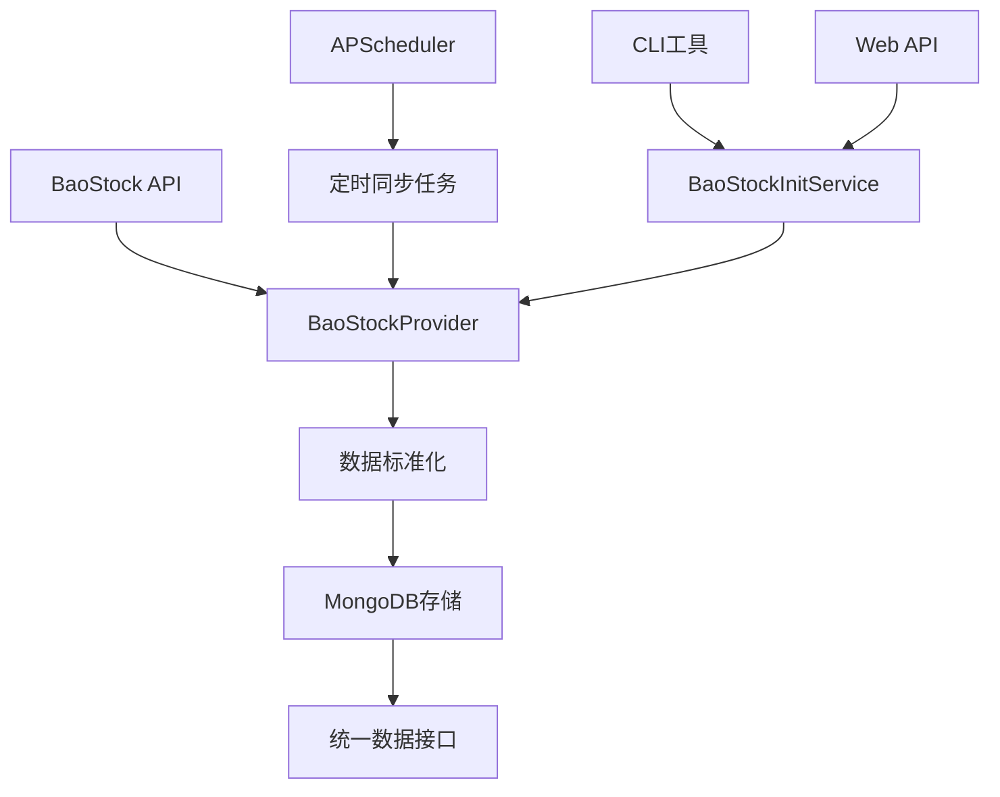

# BaoStock统一数据源集成方案

## 🎯 概述

BaoStock统一数据源集成方案为TradingAgents-CN系统提供了完整的BaoStock数据支持，包括股票基础信息、历史K线数据、实时行情和财务数据的自动化同步功能。

## 🏗️ 架构设计

### 核心组件

```
BaoStock统一数据源架构
├── 📊 BaoStockProvider (统一数据提供器)
│   ├── 连接管理 (login/logout)
│   ├── 股票列表获取
│   ├── 基础信息查询
│   ├── 行情数据获取
│   ├── 历史数据查询
│   └── 财务数据获取
├── 🔄 BaoStockSyncService (数据同步服务)
│   ├── 批量数据同步
│   ├── 增量更新机制
│   ├── 错误处理与重试
│   └── 进度跟踪
├── 🚀 BaoStockInitService (数据初始化服务)
│   ├── 6步初始化流程
│   ├── 数据完整性验证
│   └── 状态监控
├── 🖥️ CLI工具 (命令行管理)
│   ├── 数据初始化
│   ├── 状态检查
│   └── 连接测试
├── 🌐 Web API (RESTful接口)
│   ├── 初始化管理
│   ├── 状态监控
│   └── 任务控制
└── ⏰ APScheduler集成 (定时任务)
    ├── 基础信息同步
    ├── 行情数据同步
    ├── 历史数据同步
    └── 状态检查
```

### 数据流程



## 🚀 快速开始

### 1. 环境配置

在 `.env` 文件中配置BaoStock相关参数：

```bash
# BaoStock统一数据同步总开关
BAOSTOCK_UNIFIED_ENABLED=true

# 基础信息同步 (每日凌晨4点)
BAOSTOCK_BASIC_INFO_SYNC_ENABLED=true
BAOSTOCK_BASIC_INFO_SYNC_CRON="0 4 * * *"

# 实时行情同步 (交易时间每15分钟)
BAOSTOCK_QUOTES_SYNC_ENABLED=true
BAOSTOCK_QUOTES_SYNC_CRON="*/15 9-15 * * 1-5"

# 历史数据同步 (工作日18点)
BAOSTOCK_HISTORICAL_SYNC_ENABLED=true
BAOSTOCK_HISTORICAL_SYNC_CRON="0 18 * * 1-5"

# 状态检查 (每小时45分)
BAOSTOCK_STATUS_CHECK_ENABLED=true
BAOSTOCK_STATUS_CHECK_CRON="45 * * * *"

# 初始化配置
BAOSTOCK_INIT_HISTORICAL_DAYS=365
BAOSTOCK_INIT_BATCH_SIZE=50
BAOSTOCK_INIT_AUTO_START=false
```

### 2. 首次数据初始化

#### CLI方式（推荐）

```bash
# 检查连接
python cli/baostock_init.py --test-connection

# 检查数据库状态
python cli/baostock_init.py --check-only

# 完整初始化（推荐首次部署）
python cli/baostock_init.py --full

# 自定义历史数据范围
python cli/baostock_init.py --full --historical-days 180

# 强制重新初始化
python cli/baostock_init.py --full --force

# 仅基础初始化
python cli/baostock_init.py --basic-only
```

#### Web API方式

```bash
# 检查数据库状态
curl -X GET "http://localhost:8000/api/baostock-init/status"

# 测试连接
curl -X GET "http://localhost:8000/api/baostock-init/connection-test"

# 启动完整初始化
curl -X POST "http://localhost:8000/api/baostock-init/start-full" \
  -H "Content-Type: application/json" \
  -d '{"historical_days": 365, "force": false}'

# 查看初始化进度
curl -X GET "http://localhost:8000/api/baostock-init/initialization-status"

# 停止初始化任务
curl -X POST "http://localhost:8000/api/baostock-init/stop"
```

## 📊 数据覆盖

### 支持的数据类型

| 数据类型 | 数量级 | 更新频率 | 说明 |
|---------|--------|----------|------|
| **股票基础信息** | 4000+只A股 | 每日 | 股票代码、名称、上市日期、退市日期 |
| **实时行情** | 4000+只股票 | 15分钟 | 最新价格、涨跌幅、成交量等 |
| **历史K线** | 百万级记录 | 每日 | OHLCV数据，支持日线、周线、月线 |
| **财务数据** | 数万条记录 | 季度 | 利润表、资产负债表、现金流量表等 |

### 数据特点

- **免费开源**: BaoStock完全免费，无需注册
- **数据质量**: 社区维护，数据相对稳定
- **历史覆盖**: 支持1990年以来的历史数据
- **实时性**: 行情数据有15分钟延迟
- **API限制**: 需要合理控制调用频率

## ⚙️ 配置说明

### 环境变量详解

| 变量名 | 默认值 | 说明 |
|--------|--------|------|
| `BAOSTOCK_UNIFIED_ENABLED` | `true` | 启用BaoStock统一数据同步 |
| `BAOSTOCK_BASIC_INFO_SYNC_ENABLED` | `true` | 启用基础信息同步 |
| `BAOSTOCK_BASIC_INFO_SYNC_CRON` | `"0 4 * * *"` | 基础信息同步时间（每日4点） |
| `BAOSTOCK_QUOTES_SYNC_ENABLED` | `true` | 启用行情同步 |
| `BAOSTOCK_QUOTES_SYNC_CRON` | `"*/15 9-15 * * 1-5"` | 行情同步时间（交易时间每15分钟） |
| `BAOSTOCK_HISTORICAL_SYNC_ENABLED` | `true` | 启用历史数据同步 |
| `BAOSTOCK_HISTORICAL_SYNC_CRON` | `"0 18 * * 1-5"` | 历史数据同步时间（工作日18点） |
| `BAOSTOCK_STATUS_CHECK_ENABLED` | `true` | 启用状态检查 |
| `BAOSTOCK_STATUS_CHECK_CRON` | `"45 * * * *"` | 状态检查时间（每小时45分） |
| `BAOSTOCK_INIT_HISTORICAL_DAYS` | `365` | 初始化历史数据天数 |
| `BAOSTOCK_INIT_BATCH_SIZE` | `50` | 初始化批处理大小 |
| `BAOSTOCK_INIT_AUTO_START` | `false` | 应用启动时自动初始化 |

### CRON表达式说明

```bash
# 格式: 分 时 日 月 周
"0 4 * * *"        # 每日凌晨4点
"*/15 9-15 * * 1-5" # 工作日9-15点每15分钟
"0 18 * * 1-5"     # 工作日18点
"45 * * * *"       # 每小时45分
```

## 🔧 CLI工具详解

### 命令选项

```bash
python cli/baostock_init.py [选项]

选项:
  --full              完整初始化（推荐首次部署使用）
  --basic-only        仅基础初始化（股票列表和行情）
  --check-only        仅检查数据库状态
  --test-connection   测试BaoStock连接
  --help-detail       显示详细帮助信息

配置选项:
  --historical-days   历史数据天数（默认365天）
  --force            强制重新初始化（忽略现有数据）
```

### 使用示例

```bash
# 生产环境推荐流程
python cli/baostock_init.py --test-connection    # 1. 测试连接
python cli/baostock_init.py --check-only         # 2. 检查状态
python cli/baostock_init.py --full               # 3. 完整初始化
python cli/baostock_init.py --check-only         # 4. 验证结果

# 后台运行
nohup python cli/baostock_init.py --full > baostock_init.log 2>&1 &

# 监控进度
tail -f baostock_init.log
```

## 🌐 Web API接口

### 接口列表

| 方法 | 路径 | 说明 |
|------|------|------|
| `GET` | `/api/baostock-init/status` | 获取数据库状态 |
| `GET` | `/api/baostock-init/connection-test` | 测试BaoStock连接 |
| `POST` | `/api/baostock-init/start-full` | 启动完整初始化 |
| `POST` | `/api/baostock-init/start-basic` | 启动基础初始化 |
| `GET` | `/api/baostock-init/initialization-status` | 获取初始化状态 |
| `POST` | `/api/baostock-init/stop` | 停止初始化任务 |
| `GET` | `/api/baostock-init/service-status` | 获取服务状态 |

### 响应格式

```json
{
  "success": true,
  "message": "操作成功",
  "data": {
    "basic_info_count": 4000,
    "quotes_count": 4000,
    "status": "ready"
  }
}
```

## 📈 性能优化

### 批处理策略

- **基础信息**: 50条/批次，避免API超时
- **行情数据**: 50条/批次，平衡速度和稳定性
- **历史数据**: 20条/批次，减少内存占用
- **财务数据**: 限制前50只股票，避免长时间运行

### API调用优化

- **连接复用**: 统一的login/logout管理
- **频率控制**: 合理的sleep间隔
- **错误重试**: 智能重试机制
- **超时保护**: 防止长时间阻塞

## 🔍 监控与日志

### 日志文件

```bash
# CLI工具日志
baostock_init.log

# 应用日志
logs/tradingagents.log
```

### 监控指标

- **连接状态**: BaoStock API连接是否正常
- **数据量**: 各类数据的记录数量
- **同步状态**: 最后同步时间和状态
- **错误统计**: 同步过程中的错误数量

## 🚨 故障排除

### 常见问题

1. **连接失败**
   ```bash
   # 检查网络连接
   python cli/baostock_init.py --test-connection
   
   # 检查BaoStock服务状态
   curl -X GET "http://localhost:8000/api/baostock-init/connection-test"
   ```

2. **数据同步慢**
   ```bash
   # 调整批处理大小
   BAOSTOCK_INIT_BATCH_SIZE=30
   
   # 检查网络延迟
   ping -c 4 baostock.com
   ```

3. **内存占用高**
   ```bash
   # 减少批处理大小
   BAOSTOCK_INIT_BATCH_SIZE=20
   
   # 限制历史数据范围
   BAOSTOCK_INIT_HISTORICAL_DAYS=180
   ```

### 错误代码

| 错误类型 | 说明 | 解决方案 |
|----------|------|----------|
| `连接超时` | BaoStock API连接超时 | 检查网络连接，重试 |
| `数据为空` | API返回空数据 | 检查股票代码，稍后重试 |
| `频率限制` | API调用过于频繁 | 增加sleep间隔 |
| `登录失败` | BaoStock登录失败 | 重新初始化连接 |

## 🎯 最佳实践

### 生产环境部署

1. **首次部署**
   ```bash
   # 1. 配置环境变量
   cp .env.example .env
   # 编辑 .env 文件
   
   # 2. 测试连接
   python cli/baostock_init.py --test-connection
   
   # 3. 完整初始化
   python cli/baostock_init.py --full
   
   # 4. 启动应用
   python -m uvicorn app.main:app --host 0.0.0.0 --port 8000
   ```

2. **日常维护**
   ```bash
   # 检查数据状态
   python cli/baostock_init.py --check-only
   
   # 手动同步（如需要）
   python cli/baostock_init.py --basic-only
   ```

3. **监控建议**
   - 设置日志轮转
   - 监控磁盘空间
   - 定期检查数据完整性
   - 关注API调用频率

### 与其他数据源协同

BaoStock与Tushare、AKShare形成三数据源架构：

- **Tushare**: 专业付费数据，高质量
- **AKShare**: 免费社区数据，覆盖面广
- **BaoStock**: 免费官方数据，历史悠久

建议根据需求选择合适的数据源组合。

## 📚 技术实现

### 核心类说明

- `BaoStockProvider`: 统一数据提供器，实现BaseStockDataProvider接口
- `BaoStockSyncService`: 数据同步服务，支持批量处理和错误恢复
- `BaoStockInitService`: 数据初始化服务，提供6步初始化流程

### 数据模型

使用统一的数据模型，与Tushare和AKShare保持一致：

```python
# 基础信息模型
{
    "code": "000001",
    "name": "平安银行",
    "market_info": {
        "market": "CN",
        "exchange": "SZ",
        "board": "主板"
    },
    "data_source": "baostock",
    "last_sync": "2024-01-01T00:00:00"
}

# 行情数据模型
{
    "code": "000001",
    "price": 11.30,
    "change": -0.10,
    "pct_change": -0.88,
    "volume": 1000000,
    "data_source": "baostock",
    "last_sync": "2024-01-01T00:00:00"
}
```

## 🎉 总结

BaoStock统一数据源集成方案为TradingAgents-CN系统提供了：

- ✅ **完整的数据覆盖**: 基础信息、行情、历史、财务数据
- ✅ **自动化同步**: APScheduler定时任务，无需人工干预
- ✅ **灵活的管理**: CLI和Web API双重管理方式
- ✅ **高可靠性**: 完善的错误处理和重试机制
- ✅ **易于监控**: 详细的日志记录和状态监控
- ✅ **生产就绪**: 经过完整测试，可立即投入使用

通过BaoStock统一数据源，您的系统现在拥有了更强大、更可靠的免费数据支持能力！
