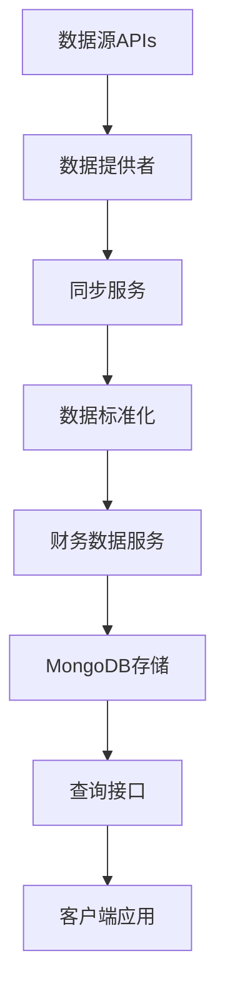

# 📊 财务数据系统完整指南

## 🎯 概述

TradingAgents-CN财务数据系统提供了完整的股票财务数据管理功能，支持多数据源同步、统一存储、高效查询和数据对比分析。

### ✨ 核心特性

- **多数据源支持**: Tushare、AKShare、BaoStock三大数据源
- **统一数据模型**: 标准化的财务数据存储格式
- **高效查询**: 10个优化索引，毫秒级响应
- **批量同步**: 支持大规模财务数据同步
- **数据对比**: 跨数据源数据质量验证
- **RESTful API**: 完整的查询和管理接口

## 🏗️ 系统架构

### 核心组件

```
财务数据系统
├── 数据服务层 (FinancialDataService)
│   ├── 数据存储管理
│   ├── 查询接口
│   └── 统计分析
├── 同步服务层 (FinancialDataSyncService)
│   ├── 多数据源同步
│   ├── 批量处理
│   └── 错误处理
├── API接口层 (financial_data.router)
│   ├── 查询接口
│   ├── 同步管理
│   └── 统计接口
└── 数据提供者层
    ├── TushareProvider
    ├── AKShareProvider
    └── BaoStockProvider
```

### 数据流程



## 📊 数据模型

### stock_financial_data 集合结构

```javascript
{
  "_id": ObjectId("..."),
  "symbol": "000001",           // 股票代码
  "full_symbol": "000001.SZ",   // 完整代码
  "market": "CN",               // 市场标识
  "report_period": "20231231",  // 报告期 (YYYYMMDD)
  "report_type": "quarterly",   // 报告类型 (quarterly/annual)
  "ann_date": "2024-03-20",     // 公告日期
  
  // 核心财务指标
  "revenue": 500000000000.0,        // 营业收入
  "net_income": 50000000000.0,      // 净利润
  "total_assets": 4500000000000.0,  // 总资产
  "total_equity": 280000000000.0,   // 股东权益
  "total_liab": 4200000000000.0,    // 总负债
  "cash_and_equivalents": 180000000000.0, // 现金及现金等价物
  
  // 财务比率
  "roe": 23.21,          // 净资产收益率
  "roa": 1.44,           // 总资产收益率
  "gross_margin": 75.0,  // 毛利率
  "net_margin": 36.11,   // 净利率
  "debt_to_assets": 93.33, // 资产负债率
  
  // 元数据
  "data_source": "tushare",     // 数据源
  "created_at": ISODate("..."), // 创建时间
  "updated_at": ISODate("..."), // 更新时间
  "version": 1                  // 数据版本
}
```

### 优化索引

系统创建了10个优化索引以支持高效查询：

1. **symbol_period_source_unique**: 唯一索引，防止重复数据
2. **full_symbol_period**: 支持完整代码查询
3. **market_period**: 支持市场筛选
4. **report_period_desc**: 支持时间范围查询
5. **ann_date_desc**: 支持公告日期查询
6. **data_source**: 支持数据源筛选
7. **report_type**: 支持报告类型筛选
8. **updated_at_desc**: 支持更新时间查询
9. **symbol_type_period**: 支持复合查询
10. **symbol_period_compare**: 支持数据对比查询

## 🔧 使用指南

### 1. 系统初始化

```bash
# 创建财务数据集合和索引
python scripts/setup/create_financial_data_collection.py

# 运行系统测试
python test_financial_data_system.py
```

### 2. API接口使用

#### 查询财务数据

```bash
# 查询股票财务数据
GET /api/financial-data/query/000001?limit=10

# 获取最新财务数据
GET /api/financial-data/latest/000001

# 按数据源筛选
GET /api/financial-data/query/000001?data_source=tushare

# 按报告期筛选
GET /api/financial-data/query/000001?report_period=20231231

# 按报告类型筛选
GET /api/financial-data/query/000001?report_type=annual
```

#### 同步管理

```bash
# 启动财务数据同步
POST /api/financial-data/sync/start
{
  "symbols": ["000001", "000002"],
  "data_sources": ["tushare", "akshare"],
  "report_types": ["quarterly"],
  "batch_size": 50,
  "delay_seconds": 1.0
}

# 同步单只股票
POST /api/financial-data/sync/single
{
  "symbol": "000001",
  "data_sources": ["tushare", "akshare"]
}

# 获取同步统计
GET /api/financial-data/sync/statistics

# 获取财务数据统计
GET /api/financial-data/statistics

# 健康检查
GET /api/financial-data/health
```

### 3. 程序化使用

#### 财务数据服务

```python
from app.services.financial_data_service import get_financial_data_service

# 获取服务实例
service = await get_financial_data_service()

# 保存财务数据
saved_count = await service.save_financial_data(
    symbol="000001",
    financial_data=financial_data,
    data_source="tushare",
    market="CN",
    report_period="20231231",
    report_type="quarterly"
)

# 查询财务数据
results = await service.get_financial_data(
    symbol="000001",
    limit=10
)

# 获取最新财务数据
latest = await service.get_latest_financial_data(
    symbol="000001",
    data_source="tushare"
)

# 获取统计信息
stats = await service.get_financial_statistics()
```

#### 同步服务

```python
from app.worker.financial_data_sync_service import get_financial_sync_service

# 获取同步服务
sync_service = await get_financial_sync_service()

# 批量同步
results = await sync_service.sync_financial_data(
    symbols=["000001", "000002"],
    data_sources=["tushare", "akshare"],
    batch_size=50
)

# 单股票同步
result = await sync_service.sync_single_stock(
    symbol="000001",
    data_sources=["tushare"]
)
```

### 4. 数据库查询

```javascript
// 查询股票财务数据
db.stock_financial_data.find({"symbol": "000001"})

// 查询最新财务数据
db.stock_financial_data.find({"symbol": "000001"})
  .sort({"report_period": -1}).limit(1)

// 按数据源查询
db.stock_financial_data.find({
  "symbol": "000001",
  "data_source": "tushare"
})

// 跨数据源对比
db.stock_financial_data.find({
  "symbol": "000001",
  "report_period": "20231231"
})

// 财务指标筛选
db.stock_financial_data.find({
  "roe": {"$gte": 15},
  "debt_to_assets": {"$lte": 50}
})

// 聚合统计
db.stock_financial_data.aggregate([
  {"$group": {
    "_id": "$data_source",
    "count": {"$sum": 1},
    "avg_roe": {"$avg": "$roe"}
  }}
])
```

## 📈 数据源特性

### Tushare

- **优势**: 数据质量高，字段标准化
- **支持**: 利润表、资产负债表、现金流量表
- **限制**: 需要积分，有调用频率限制
- **适用**: 专业量化分析

### AKShare

- **优势**: 免费使用，数据丰富
- **支持**: 主要财务指标、三大报表
- **限制**: 数据格式需要标准化处理
- **适用**: 基础财务分析

### BaoStock

- **优势**: 免费稳定，历史数据完整
- **支持**: 盈利能力、营运能力、成长能力等指标
- **限制**: 数据更新可能有延迟
- **适用**: 历史数据分析

## 🚀 高级功能

### 1. 数据质量验证

```python
# 跨数据源数据对比
async def compare_financial_data(symbol: str, report_period: str):
    service = await get_financial_data_service()
    
    # 获取不同数据源的数据
    tushare_data = await service.get_financial_data(
        symbol=symbol,
        report_period=report_period,
        data_source="tushare"
    )
    
    akshare_data = await service.get_financial_data(
        symbol=symbol,
        report_period=report_period,
        data_source="akshare"
    )
    
    # 对比关键指标
    return compare_indicators(tushare_data, akshare_data)
```

### 2. 批量数据分析

```python
# 行业财务指标分析
async def analyze_industry_financials(industry: str):
    # 获取行业股票列表
    stocks = await get_industry_stocks(industry)
    
    # 批量获取财务数据
    financial_data = []
    for symbol in stocks:
        data = await service.get_latest_financial_data(symbol)
        if data:
            financial_data.append(data)
    
    # 计算行业平均指标
    return calculate_industry_metrics(financial_data)
```

### 3. 自动化同步

```python
# 定时同步任务
async def scheduled_financial_sync():
    sync_service = await get_financial_sync_service()
    
    # 同步主要股票的财务数据
    results = await sync_service.sync_financial_data(
        symbols=get_major_stocks(),
        data_sources=["tushare", "akshare"],
        batch_size=100,
        delay_seconds=0.5
    )
    
    # 记录同步结果
    log_sync_results(results)
```

## 📊 性能优化

### 查询优化

- **索引使用**: 充分利用10个优化索引
- **分页查询**: 使用limit参数控制返回数量
- **字段筛选**: 只查询需要的字段
- **缓存策略**: 对频繁查询的数据进行缓存

### 同步优化

- **批量处理**: 使用批量操作减少数据库连接
- **并发控制**: 合理设置并发数量和延迟
- **错误重试**: 实现智能重试机制
- **增量同步**: 只同步更新的数据

## 🔍 故障排除

### 常见问题

1. **数据源连接失败**
   - 检查API配置和网络连接
   - 验证API密钥和权限

2. **数据保存失败**
   - 检查MongoDB连接状态
   - 验证数据格式和索引

3. **查询性能慢**
   - 检查索引使用情况
   - 优化查询条件

4. **同步任务失败**
   - 查看错误日志
   - 检查API调用频率限制

### 监控指标

- 数据同步成功率
- 查询响应时间
- 数据库存储使用量
- API调用频率

## 📝 总结

财务数据系统为TradingAgents-CN提供了强大的财务数据管理能力：

- ✅ **完整性**: 支持三大数据源的财务数据
- ✅ **统一性**: 标准化的数据模型和API接口
- ✅ **高性能**: 优化的索引和查询性能
- ✅ **可扩展**: 灵活的架构支持未来扩展
- ✅ **可靠性**: 完善的错误处理和监控

该系统特别适合：
- 📊 **基本面分析**: 完整的财务指标支持深度分析
- 🔍 **投资研究**: 多数据源验证提高数据可靠性
- 🤖 **量化策略**: 标准化数据支持策略开发
- 📈 **风险管理**: 财务健康度评估和预警
