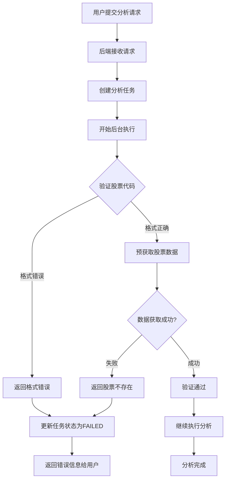

# 后端股票代码验证功能

## 问题描述

用户反馈：输入港股代码 `00700`（腾讯控股）后，后端没有识别出该股票不存在或格式错误，而是继续执行分析，导致浪费时间和资源。

**问题根源**：
1. ❌ 后端在开始分析前**没有验证**股票代码是否存在
2. ❌ 港股代码格式化逻辑有误（`00700` → `00700.HK` 而不是 `0700.HK`）
3. ❌ 即使股票代码不存在，分析任务也会继续执行

## 解决方案

### 1. 在分析开始前添加股票代码验证

**文件**：`app/services/simple_analysis_service.py`

**位置**：`execute_analysis_background` 方法开始处

**修改内容**：

```python
async def execute_analysis_background(
    self,
    task_id: str,
    user_id: str,
    request: SingleAnalysisRequest
):
    """在后台执行分析任务"""
    # ... 日志记录 ...
    
    progress_tracker = None
    try:
        logger.info(f"🚀 开始后台执行分析任务: {task_id}")
        
        # 🔍 验证股票代码是否存在
        logger.info(f"🔍 开始验证股票代码: {request.stock_code}")
        from tradingagents.utils.stock_validator import prepare_stock_data
        
        # 获取市场类型
        market_type = request.parameters.market_type if request.parameters else "A股"

        # 获取分析日期并转换为字符串格式
        analysis_date = request.parameters.analysis_date if request.parameters else None
        if analysis_date:
            # 如果是 datetime 对象，转换为字符串
            if isinstance(analysis_date, datetime):
                analysis_date = analysis_date.strftime('%Y-%m-%d')
            # 如果是字符串，确保格式正确
            elif isinstance(analysis_date, str):
                try:
                    parsed_date = datetime.strptime(analysis_date, '%Y-%m-%d')
                    analysis_date = parsed_date.strftime('%Y-%m-%d')
                except ValueError:
                    analysis_date = datetime.now().strftime('%Y-%m-%d')

        # 验证股票代码并预获取数据
        validation_result = await asyncio.to_thread(
            prepare_stock_data,
            stock_code=request.stock_code,
            market_type=market_type,
            period_days=30,
            analysis_date=analysis_date
        )
        
        if not validation_result.is_valid:
            error_msg = f"❌ 股票代码验证失败: {validation_result.error_message}"
            logger.error(error_msg)
            logger.error(f"💡 建议: {validation_result.suggestion}")
            
            # 更新任务状态为失败
            await self.memory_manager.update_task_status(
                task_id=task_id,
                status=AnalysisStatus.FAILED,
                progress=0,
                error_message=validation_result.error_message
            )
            
            # 更新MongoDB状态
            await self._update_task_status(
                task_id,
                AnalysisStatus.FAILED,
                0,
                error_message=validation_result.error_message
            )
            
            return
        
        logger.info(f"✅ 股票代码验证通过: {request.stock_code} - {validation_result.stock_name}")
        logger.info(f"📊 市场类型: {validation_result.market_type}")
        logger.info(f"📈 历史数据: {'有' if validation_result.has_historical_data else '无'}")
        logger.info(f"📋 基本信息: {'有' if validation_result.has_basic_info else '无'}")
        
        # ... 继续执行分析 ...
```

### 2. 修复港股代码格式化逻辑

**文件**：`tradingagents/utils/stock_validator.py`

**位置**：`_prepare_hk_stock_data` 方法

**问题**：
```python
# ❌ 旧代码
formatted_code = f"{stock_code.zfill(4)}.HK"

# 输入: 00700
# 输出: 00700.HK  ← 错误！应该是 0700.HK
```

**修复**：
```python
# ✅ 新代码
# 移除前导0，然后补齐到4位
clean_code = stock_code.lstrip('0') or '0'  # 如果全是0，保留一个0
formatted_code = f"{clean_code.zfill(4)}.HK"
logger.debug(f"🔍 [港股数据] 代码格式化: {stock_code} → {formatted_code}")

# 输入: 00700
# 处理: 00700 → 700 → 0700
# 输出: 0700.HK  ← 正确！
```

**格式化示例**：

| 输入 | 处理步骤 | 输出 |
|------|---------|------|
| `700` | `700` → `0700` | `0700.HK` ✅ |
| `00700` | `00700` → `700` → `0700` | `0700.HK` ✅ |
| `9988` | `9988` → `9988` | `9988.HK` ✅ |
| `09988` | `09988` → `9988` → `9988` | `9988.HK` ✅ |
| `1810` | `1810` → `1810` | `1810.HK` ✅ |
| `01810` | `01810` → `1810` → `1810` | `1810.HK` ✅ |

## 验证流程

### 完整的验证流程



### 验证步骤详解

#### 1. 格式验证

**A股**：
```python
# 必须是6位数字
if not re.match(r'^\d{6}$', stock_code):
    return error("A股代码格式错误，应为6位数字")

# 验证前缀
prefix = stock_code[:2]
valid_prefixes = ['60', '68', '00', '30', '43', '83', '87']
if prefix not in valid_prefixes:
    return error("A股代码前缀不正确")
```

**港股**：
```python
# 4-5位数字.HK 或 纯4-5位数字
hk_format = re.match(r'^\d{4,5}\.HK$', stock_code.upper())
digit_format = re.match(r'^\d{4,5}$', stock_code)

if not (hk_format or digit_format):
    return error("港股代码格式错误")
```

**美股**：
```python
# 1-5位字母
if not re.match(r'^[A-Z]{1,5}$', stock_code.upper()):
    return error("美股代码格式错误，应为1-5位字母")
```

#### 2. 数据预获取验证

**A股验证**：
```python
# 1. 获取基本信息
stock_info = get_stock_info_unified(stock_code)
if not stock_info or "❌" in stock_info:
    return error("无法获取股票基本信息")

# 2. 验证股票名称
stock_name = extract_stock_name(stock_info)
if stock_name == "未知" or stock_name.startswith(f"股票{stock_code}"):
    return error(f"股票代码 {stock_code} 不存在或信息无效")

# 3. 获取历史数据
historical_data = get_stock_data_unified(stock_code, start_date, end_date)
if not historical_data or "❌" in historical_data:
    return error("无法获取股票历史数据")

# 4. 验证数据有效性
if len(historical_data) < 100:
    return error("历史数据不足")
```

**港股验证**：
```python
# 1. 格式化代码
formatted_code = format_hk_code(stock_code)  # 00700 → 0700.HK

# 2. 获取基本信息
stock_info = get_hk_stock_info_unified(formatted_code)
if not stock_info or "❌" in stock_info or "未找到" in stock_info:
    return error(f"港股代码 {formatted_code} 不存在或信息无效")

# 3. 解析股票名称
stock_name = extract_hk_stock_name(stock_info, formatted_code)
if not stock_name or stock_name == "未知":
    return error(f"港股代码 {formatted_code} 不存在或信息无效")

# 4. 获取历史数据
historical_data = get_hk_stock_data_unified(formatted_code, start_date, end_date)
if not historical_data or "❌" in historical_data:
    return error("无法获取港股历史数据")
```

**美股验证**：
```python
# 1. 格式化代码（转大写）
formatted_code = stock_code.upper()

# 2. 获取基本信息
stock_info = get_us_stock_info_unified(formatted_code)
if not stock_info or "❌" in stock_info:
    return error(f"美股代码 {formatted_code} 不存在或信息无效")

# 3. 获取历史数据
historical_data = get_us_stock_data_unified(formatted_code, start_date, end_date)
if not historical_data or "❌" in historical_data:
    return error("无法获取美股历史数据")
```

## 错误处理

### 验证失败时的处理

```python
if not validation_result.is_valid:
    # 1. 记录错误日志
    logger.error(f"❌ 股票代码验证失败: {validation_result.error_message}")
    logger.error(f"💡 建议: {validation_result.suggestion}")
    
    # 2. 更新内存中的任务状态
    await self.memory_manager.update_task_status(
        task_id=task_id,
        status=AnalysisStatus.FAILED,
        progress=0,
        error_message=validation_result.error_message
    )
    
    # 3. 更新MongoDB中的任务状态
    await self._update_task_status(
        task_id,
        AnalysisStatus.FAILED,
        0,
        error_message=validation_result.error_message
    )
    
    # 4. 立即返回，不执行分析
    return
```

### 错误信息示例

#### A股错误

```json
{
  "is_valid": false,
  "stock_code": "000999",
  "market_type": "A股",
  "error_message": "股票代码 000999 不存在或信息无效",
  "suggestion": "请检查股票代码是否正确，或确认该股票是否已上市"
}
```

#### 港股错误

```json
{
  "is_valid": false,
  "stock_code": "0700.HK",
  "market_type": "港股",
  "error_message": "港股代码 0700.HK 不存在或信息无效",
  "suggestion": "请检查港股代码是否正确，格式如：0700.HK"
}
```

#### 美股错误

```json
{
  "is_valid": false,
  "stock_code": "ABCD",
  "market_type": "美股",
  "error_message": "美股代码 ABCD 不存在或信息无效",
  "suggestion": "请检查美股代码是否正确，如：AAPL、MSFT"
}
```

## 测试用例

### A股测试

| 股票代码 | 预期结果 | 说明 |
|---------|---------|------|
| `000001` | ✅ 通过 | 平安银行（存在） |
| `600519` | ✅ 通过 | 贵州茅台（存在） |
| `000999` | ❌ 失败 | 不存在的代码 |
| `999999` | ❌ 失败 | 不存在的代码 |
| `00001` | ❌ 失败 | 格式错误（5位） |

### 港股测试

| 输入代码 | 格式化后 | 预期结果 | 说明 |
|---------|---------|---------|------|
| `700` | `0700.HK` | ✅ 通过 | 腾讯控股（存在） |
| `00700` | `0700.HK` | ✅ 通过 | 腾讯控股（存在） |
| `9988` | `9988.HK` | ✅ 通过 | 阿里巴巴（存在） |
| `09988` | `9988.HK` | ✅ 通过 | 阿里巴巴（存在） |
| `99999` | `99999.HK` | ❌ 失败 | 不存在的代码 |
| `0700.HK` | `0700.HK` | ✅ 通过 | 腾讯控股（存在） |

### 美股测试

| 股票代码 | 预期结果 | 说明 |
|---------|---------|------|
| `AAPL` | ✅ 通过 | 苹果（存在） |
| `MSFT` | ✅ 通过 | 微软（存在） |
| `GOOGL` | ✅ 通过 | 谷歌（存在） |
| `ABCDE` | ❌ 失败 | 不存在的代码 |
| `ZZZZZ` | ❌ 失败 | 不存在的代码 |

## 性能优化

### 数据缓存

验证过程中获取的数据会被缓存，避免重复获取：

```python
# 1. 基本信息缓存
stock_info = get_stock_info_unified(stock_code)  # 会缓存到Redis

# 2. 历史数据缓存
historical_data = get_stock_data_unified(stock_code, start_date, end_date)  # 会缓存到Redis

# 3. 分析时直接使用缓存
# 不需要重新获取数据，提高分析速度
```

### 超时控制

```python
self.timeout_seconds = 15  # 数据获取超时时间

# 如果15秒内无法获取数据，返回验证失败
```

## 总结

### 修复前

```
用户输入: 00700
↓
后端接收: 00700
↓
开始分析（没有验证）
↓
分析过程中发现数据获取失败
↓
浪费时间和资源 ❌
```

### 修复后

```
用户输入: 00700
↓
后端接收: 00700
↓
验证股票代码
  ├─ 格式验证: ✅ 通过（4-5位数字）
  ├─ 格式化: 00700 → 0700.HK
  ├─ 获取基本信息: ✅ 成功（腾讯控股）
  └─ 获取历史数据: ✅ 成功
↓
验证通过，开始分析 ✅
```

### 优点

1. ✅ **提前验证**：在分析开始前验证股票代码
2. ✅ **快速失败**：无效代码立即返回错误，不浪费资源
3. ✅ **清晰提示**：提供详细的错误信息和建议
4. ✅ **数据缓存**：验证时获取的数据可在分析时复用
5. ✅ **格式标准化**：自动修正港股代码格式

### 后续优化

1. 添加股票代码白名单/黑名单
2. 支持批量验证
3. 添加验证结果缓存（避免重复验证同一股票）
4. 支持更多市场（新加坡、日本等）

