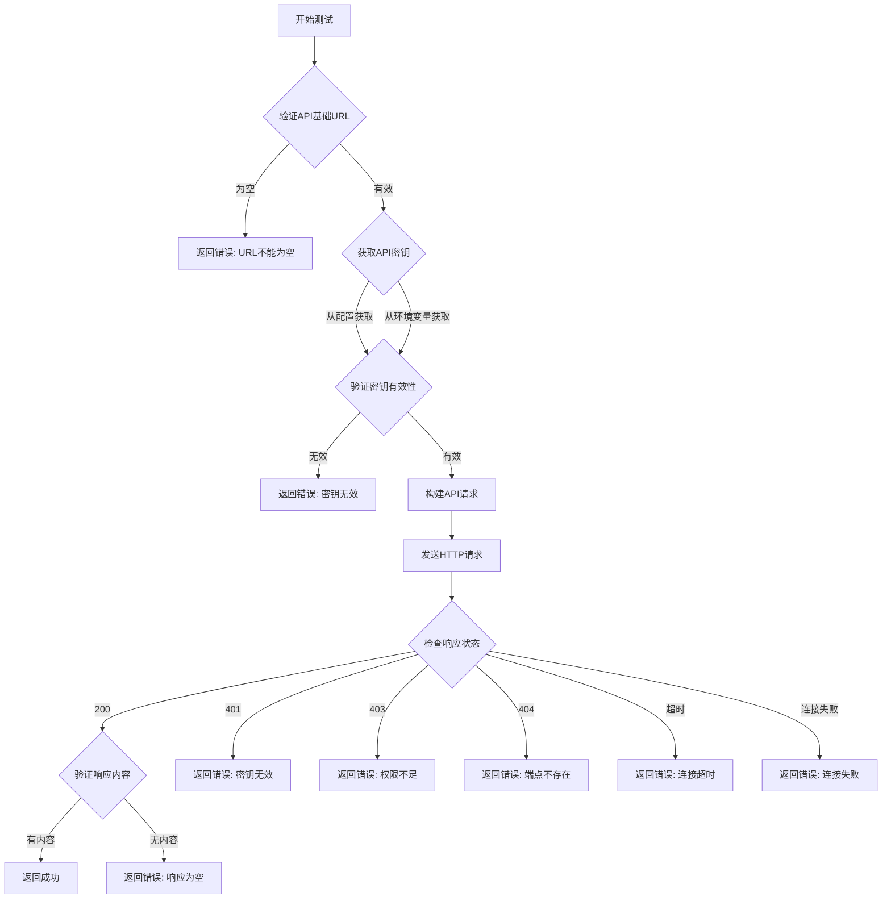

# 大模型配置测试功能修复说明

> **修复版本**: v1.0.0-preview  
> **修复日期**: 2025-10-21  
> **问题编号**: #用户反馈

---

## 📋 问题描述

### 用户反馈

用户在"大模型配置"页面填写配置时，发现**填写任意API基础URL（如 `http://127.0.0.1`）都能测试成功**，这显然是错误的。

### 问题截图

用户填写了 `http://127.0.0.1` 作为API基础URL，点击测试后显示"测试成功"。

### 根本原因

检查代码后发现，`app/services/config_service.py` 中的 `test_llm_config` 方法**只是模拟测试**：

```python
async def test_llm_config(self, llm_config: LLMConfig) -> Dict[str, Any]:
    """测试大模型配置"""
    start_time = time.time()
    try:
        # 这里应该实际调用LLM API进行测试
        # 目前返回模拟结果
        await asyncio.sleep(1)  # 模拟API调用  ❌ 只是 sleep，没有真正测试！
        
        return {
            "success": True,  # ❌ 永远返回成功！
            "message": f"成功连接到 {provider_str} {llm_config.model_name}",
            ...
        }
```

**问题**：
1. ❌ 没有真正调用API进行验证
2. ❌ 没有验证API基础URL是否正确
3. ❌ 没有验证API密钥是否有效
4. ❌ 永远返回成功，无论配置是否正确

---

## ✅ 修复方案

### 1. 实现真实的API调用测试

修改后的 `test_llm_config` 方法会：

1. **验证必需字段**：
   - 检查API基础URL是否为空
   - 检查API密钥是否有效

2. **构建真实的API请求**：
   ```python
   # 构建标准的 OpenAI 兼容 API 请求
   url = f"{api_base}/v1/chat/completions"
   
   headers = {
       "Content-Type": "application/json",
       "Authorization": f"Bearer {api_key}"
   }
   
   data = {
       "model": llm_config.model_name,
       "messages": [
           {"role": "user", "content": "Hello, please respond with 'OK' if you can read this."}
       ],
       "max_tokens": 10,
       "temperature": 0.1
   }
   ```

3. **发送HTTP请求并验证响应**：
   ```python
   response = requests.post(url, json=data, headers=headers, timeout=15)
   
   if response.status_code == 200:
       # 验证响应内容
       result = response.json()
       if "choices" in result and len(result["choices"]) > 0:
           content = result["choices"][0]["message"]["content"]
           if content and len(content.strip()) > 0:
               return {"success": True, ...}  # ✅ 真正的成功
   ```

### 2. 增强错误处理

修复后会区分不同的错误情况：

| HTTP状态码 | 错误信息 |
|-----------|---------|
| 401 | API密钥无效或已过期 |
| 403 | API权限不足或配额已用完 |
| 404 | API端点不存在，请检查API基础URL是否正确 |
| Timeout | 连接超时，请检查API基础URL是否正确或网络是否可达 |
| ConnectionError | 连接失败，请检查API基础URL是否正确 |

### 3. 改进API密钥验证

增强 `_is_valid_api_key` 方法，增加截断密钥检测：

```python
def _is_valid_api_key(self, api_key: Optional[str]) -> bool:
    """判断 API Key 是否有效"""
    if not api_key:
        return False
    
    # 检查是否为截断的密钥（包含 '...'）
    if '...' in api_key:
        return False  # ❌ 截断的密钥无效
    
    # 检查长度
    if len(api_key) <= 10:
        return False
    
    return True
```

### 4. 详细的日志输出

修复后会输出详细的测试日志：

```
🧪 测试大模型配置: dashscope - qwen-max
📍 API基础URL: http://127.0.0.1
✅ 从厂家配置获取到API密钥
🌐 发送测试请求到: http://127.0.0.1/v1/chat/completions
📡 收到响应: HTTP 404
❌ 测试失败: API端点不存在
```

---

## 🧪 测试场景

### 场景1：正确的配置 ✅

**输入**：
- API基础URL: `https://dashscope.aliyuncs.com/compatible-mode/v1`
- 模型代码: `qwen-max`
- 厂家已配置有效的API密钥

**预期结果**：
```
✅ 测试成功
成功连接到 dashscope qwen-max
响应时间: 1.2秒
```

### 场景2：错误的API基础URL ❌

**输入**：
- API基础URL: `http://127.0.0.1`
- 模型代码: `qwen-max`

**预期结果**：
```
❌ 测试失败
连接失败，请检查API基础URL是否正确: Connection refused
```

### 场景3：空的API基础URL ❌

**输入**：
- API基础URL: （空）
- 模型代码: `qwen-max`

**预期结果**：
```
❌ 测试失败
API基础URL不能为空
```

### 场景4：无效的API密钥 ❌

**输入**：
- API基础URL: `https://dashscope.aliyuncs.com/compatible-mode/v1`
- 模型代码: `qwen-max`
- 厂家未配置API密钥或密钥无效

**预期结果**：
```
❌ 测试失败
dashscope 未配置有效的API密钥
```

### 场景5：截断的API密钥 ❌

**输入**：
- 厂家配置中显示的密钥: `sk-99054...`（截断显示）

**预期结果**：
```
❌ 测试失败
dashscope 未配置有效的API密钥
```

---

## 📝 使用说明

### 如何测试大模型配置

1. **打开系统设置页面**
   - 点击左侧菜单"设置" → "配置管理"

2. **选择大模型配置**
   - 点击"大模型配置"标签页

3. **编辑或添加模型配置**
   - 点击"添加模型"或编辑现有模型
   - 填写必需字段：
     - 供应商：选择厂家（如"阿里云百炼"）
     - 选择模型：从列表中选择模型
     - 模型代码：填写实际的模型标识符（如 `qwen-max`）
     - **API基础URL**：填写正确的API端点地址

4. **点击"测试"按钮**
   - 系统会发送真实的API请求进行验证
   - 等待测试结果（通常1-3秒）

5. **查看测试结果**
   - ✅ 成功：显示"测试成功"消息
   - ❌ 失败：显示具体的错误信息

### 常见错误及解决方法

#### 错误1：API端点不存在

**错误信息**：
```
API端点不存在，请检查API基础URL是否正确: http://127.0.0.1/v1/chat/completions
```

**解决方法**：
- 检查API基础URL是否正确
- 参考厂家文档获取正确的API端点
- 常见的正确格式：
  - 阿里百炼：`https://dashscope.aliyuncs.com/compatible-mode/v1`
  - DeepSeek：`https://api.deepseek.com`
  - OpenAI：`https://api.openai.com/v1`

#### 错误2：连接超时

**错误信息**：
```
连接超时，请检查API基础URL是否正确或网络是否可达
```

**解决方法**：
- 检查网络连接
- 如果是国外API（OpenAI、Google AI），需要配置代理
- 参考：[代理配置指南](./proxy-configuration.md)

#### 错误3：API密钥无效

**错误信息**：
```
API密钥无效或已过期
```

**解决方法**：
- 在"厂家管理"中检查API密钥是否正确
- 确认API密钥未过期
- 重新生成API密钥并更新配置

---

## 🔍 技术细节

### API测试流程



### 代码位置

- **测试方法**：`app/services/config_service.py` → `test_llm_config()`
- **API端点**：`app/routers/config.py` → `POST /api/config/test`
- **前端调用**：`frontend/src/views/Settings/ConfigManagement.vue` → `testLLMConfig()`

---

## 📚 相关文档

- [系统配置指南](../user-guide/system-configuration.md)
- [LLM厂家配置](../user-guide/llm-provider-configuration.md)
- [代理配置指南](./proxy-configuration.md)

---

**文档版本**: v1.0  
**最后更新**: 2025-10-21

